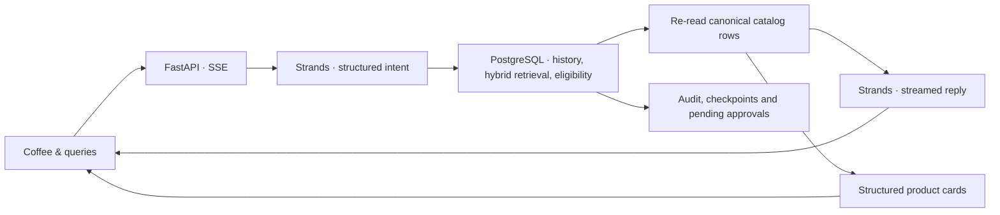

# Coffee & queries

[](requirements.txt)
[](schema.sql)
[](search.py)
[](llm.py)
[](docs/STREAMING.md)

Conference demo for **[Postgres Summit US 2026](https://2026.postgressummit.us/)** in New York City.

**Session:** [Hybrid Search in PostgreSQL: Combining Vector and Full-Text for Real-World Applications](https://postgresql.us/events/postgressummitus2026/schedule/session/2349-hybrid-search-in-postgresql-combining-vector-and-full-text-for-real-world-applications/)

**Speaker:** Shayon Sanyal · **When:** Wednesday, September 30, 2026, 10:30–11:20 EDT

**Where:** Letterpress · Convene, 555 Broadway, New York, NY

A coffee concierge that makes the data behind an agent visible. Choose a regular, ask for beans, and watch PostgreSQL supply conversation history, hybrid search results, product facts, audit records, and approval state.

The **Coffee & queries** interface is the conference demo's visual baseline: warm paper surfaces, regulars' portraits, a conversation, and a live SQL trace. It now connects to streaming replies, model selection, and coffee product cards backed by the catalog.

[Product overview](PRODUCT.md) · [Streaming and API contract](docs/STREAMING.md) · [Coffee artwork](static/products/README.md) · [Conference deck](deck/)

## Run locally

Use Python 3.11+, PostgreSQL with `vector` and `pg_trgm`, and access to a configured model provider. PostgreSQL 17 is the tested local setup.

Create a dedicated demo database once:

```bash
brew install postgresql@17 pgvector
brew services start postgresql@17
psql -d postgres -c "CREATE ROLE coffee LOGIN PASSWORD 'coffee';"
psql -d postgres -c "CREATE DATABASE coffee OWNER coffee;"
```

Then, from this directory:

```bash
python3 -m venv .venv
source .venv/bin/activate
python -m pip install -r requirements.txt
cp .env.example .env  # first setup only; preserve an existing .env
python scripts/initialize_demo.py
./run-demo.sh
```

Open **http://127.0.0.1:8017**. The initializer seeds an empty database and preserves an existing populated catalog. The first embedding call downloads the local model. Configure credentials on the server; the browser never receives them.

For a database created by an older version, apply these migrations in order. They preserve catalog rows, embeddings, customers, and conversations; the second rebuilds the derived search column and briefly locks the catalog. Set `DATABASE_URL` in your shell to the intended database first.

```bash
psql "$DATABASE_URL" -v ON_ERROR_STOP=1 -f migrations/20260902_hybrid_search.sql
psql "$DATABASE_URL" -v ON_ERROR_STOP=1 -f migrations/20260907_flavor_search.sql
```

Do not run `schema.sql` against data you want to keep: it drops and recreates the demo tables. `GET /api/search/status` reports catalog and index readiness.

## Models and streaming

Select a model route in the conversation:

| Route | Default intent / response models | Server configuration |
| --- | --- | --- |
| Bedrock OpenAI | GPT-5.6 Luna / Sol | AWS credentials and access to the configured model IDs |
| Bedrock Claude | Haiku 4.5 / Sonnet 5 | AWS credentials and access to the configured model IDs |
| OpenAI API | GPT-5.6 Luna / Sol | `OPENAI_API_KEY` |

These are the application's configured defaults, not a guarantee of account or regional availability. Override model IDs in [.env.example](.env.example). Bedrock streaming requires [`bedrock:InvokeModelWithResponseStream`](https://docs.aws.amazon.com/bedrock/latest/APIReference/API_runtime_ConverseStream.html).

Strands handles the model calls. Python controls the database steps. The browser receives actual server events and response text as they arrive. A failed stream keeps the partial reply visibly incomplete and restores the question for review.

## Try the demo

Regulars are keyed by stable customer IDs; displayed names come from PostgreSQL. Fresh seeds use Marco, Ana, and Yuki. Customized catalogs can use different names.

| Regular | First question | Follow-up | What to inspect |
| --- | --- | --- | --- |
| Pour-over regular | Cold brew options | Something lighter and more floral | History, filters, hybrid retrieval |
| Espresso regular | Cold brew options | Order that | Same-session referent and a pending approval |
| Tokyo buyer | Any Japanese single-origins in stock? | What do you have from Asia-Pacific then? | Empty results and origin filters |

Click a regular or press `1`, `2`, or `3`. Press `/` to focus the composer. **New session** starts a conversation without deleting saved history. Customer, session, and model controls stay fixed while a reply runs.

Each completed recommendation includes product cards with verified names, origins, roasts, tasting notes, prices, and stock. Packaging illustrations are shared by roast family. Prices and availability are checked for that reply and may change later.

Order requests create **pending approval records**. This demo does not fulfill orders, charge customers, or decrement inventory. It currently queues one bag per request.

## How it works



Hybrid retrieval combines pgvector cosine ranking with PostgreSQL full-text ranking using reciprocal-rank fusion. Budget, roast, origin, and stock filters apply before candidate limits. Embeddings use `BAAI/bge-small-en-v1.5` locally through FastEmbed, with 384 dimensions.

| Table | Role |
| --- | --- |
| `customers` | Customer profiles |
| `beans` | Catalog, stock, prices, full-text document, embeddings |
| `orders` | Historical purchases |
| `agent_sessions` | Customer ownership and workflow checkpoints |
| `agent_messages` | Conversation turns and completed recommendations |
| `tools` | Tool descriptions and discovery embeddings |
| `tool_audit` | SQL and successful model-call audit records |
| `approvals` | Pending order requests |

`mcp_server.py` exposes allowlisted, read-only SQL tools over stdio. Search and optional experiment APIs remain available to programmatic clients; the browser focuses on the concierge and its trace.

## What the demo establishes

Product-card facts come from canonical rows, independently of generated prose. The backend checks session ownership, validates intent, and rechecks eligibility. The browser restricts generated markup to a small formatting allowlist.

Generated prose can still be wrong or influenced by prompt injection. The data-coverage score is a heuristic, not a probability of correctness. Purchase examples and checkpoints are inspectable; automatic crash recovery and fulfillment are not implemented.

This is a local conference application with no authentication. Keep the default loopback binding. Optional stage experiment controls default to off. `./reset.sh` deliberately deletes sessions, messages, audits, and approvals; use it only to clear a rehearsal.

## Validate

```bash
python -m pip install -r requirements-dev.txt
python -m unittest discover -s tests
node --test tests/test_stream.mjs
python -m playwright install chromium
python tests/browser_coffee.py http://127.0.0.1:8017
```

Set `TEST_DATABASE_URL` to run SQL regressions in temporary tables. Tests that modify experiment fixtures require the separate `EXPERIMENT_TEST_DATABASE_URL` opt-in. Browser checks use controlled responses and make no model calls or order writes.

## Source map

| File | Responsibility |
| --- | --- |
| [static/index.html](static/index.html) | Coffee & queries layout and design |
| [static/app.js](static/app.js) | Customers, models, streaming and product cards |
| [static/stream.mjs](static/stream.mjs) | SSE decoding and completion checks |
| [static/render.mjs](static/render.mjs) | Safe response formatting |
| [app.py](app.py) | FastAPI and streaming worker bridge |
| [agents.py](agents.py) | Intent, memory, retrieval, verification and approvals |
| [llm.py](llm.py) | Strands provider adapters |
| [catalog.py](catalog.py) | Public product fields and artwork mapping |
| [search.py](search.py) | Shared SQL retrieval |
| [db.py](db.py) | Local/Aurora connections and embeddings |
| [schema.sql](schema.sql) | Database schema |
| [seed.py](seed.py) | Demo catalog, customers, orders and tools |

The [Marp deck](deck/) retains the GitHub coffee design. Build it with `./deck/build.sh`; its scripted model names may differ from the route selected in the live app.
