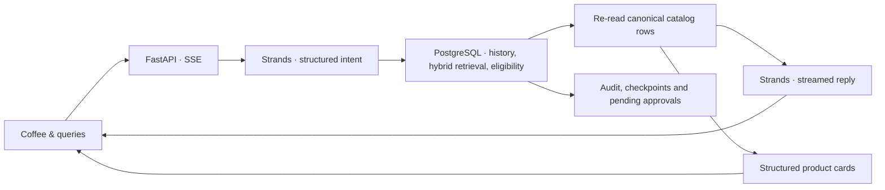

# Coffee & queries

[](requirements.txt)
[](schema.sql)
[](search.py)
[](llm.py)
[](docs/STREAMING.md)

Conference demo for **[Postgres Summit US 2026](https://2026.postgressummit.us/)** in New York City.

**Session:** [Hybrid Search in PostgreSQL: Combining Vector and Full-Text for Real-World Applications](https://postgresql.us/events/postgressummitus2026/schedule/session/2349-hybrid-search-in-postgresql-combining-vector-and-full-text-for-real-world-applications/)

**Speaker:** Shayon Sanyal · **When:** Wednesday, September 30, 2026, 10:30–11:20 EDT

**Where:** Letterpress · Convene, 555 Broadway, New York, NY

A coffee search lab that makes PostgreSQL retrieval visible. Compare keyword, vector, and hybrid rankings; inspect the catalog; run conference experiments; and ask the streaming concierge for a recommendation.

The **Coffee & queries** interface pairs warm paper surfaces and regulars' portraits with real query evidence. All four pages use the same PostgreSQL catalog, and the Concierge adds conversation history, model selection, live telemetry, and catalog-backed product cards.

[Product overview](PRODUCT.md) · [Seven-minute demo](docs/DEMO.md) · [Streaming and API contract](docs/STREAMING.md) · [Coffee artwork](static/products/README.md) · [Conference deck](deck/)

## Run locally

Use Python 3.11+ and PostgreSQL 18 with `vector` and `pg_trgm`. The Lab, Catalog,
and Experiments use local embeddings and SQL; the Concierge also needs access
to a configured model provider. The local runtime is PostgreSQL 18.4 with
pgvector 0.8.2.

Create and start a dedicated demo database from this directory:

```bash
brew install postgresql@18 pgvector
./scripts/postgres18.sh start
```

The helper keeps its cluster in the ignored `.local/postgres18` directory and
listens only on `127.0.0.1:5433`. It leaves existing PostgreSQL services alone.
Use `./scripts/postgres18.sh status` or `stop` to manage this cluster.
On a non-Homebrew installation, set `PG18_BIN` to the PostgreSQL 18 bin directory.
`COFFEE_PG18_LOCALE` selects an installed UTF-8 locale (default `en_US.UTF-8`).

Then create the Python environment and initialize an empty catalog:

```bash
python3 -m venv .venv
source .venv/bin/activate
python -m pip install -r requirements.txt
cp .env.example .env  # first setup only; preserve an existing .env
python scripts/initialize_demo.py
./run-demo.sh
```

Open **http://127.0.0.1:8017**. The initializer seeds an empty database and preserves an existing populated catalog. The first embedding call downloads the local model. Configure credentials on the server; the browser never receives them.

`./run-demo.sh` defaults to the local PostgreSQL 18 database on port 5433.
Explicit shell `DATABASE_URL` and `DEMO_MODE` overrides are preserved. Keep the
initializer's configuration pointed at the same database. See the
[PostgreSQL 18 migration notes](docs/POSTGRES18.md) when moving an existing demo.

For a database created by an older version, apply these migrations in order. They preserve catalog rows, embeddings, customers, and conversations; the second rebuilds the derived search column and briefly locks the catalog. Set `DATABASE_URL` in your shell to the intended database first.

```bash
psql "$DATABASE_URL" -v ON_ERROR_STOP=1 -f migrations/20260902_hybrid_search.sql
psql "$DATABASE_URL" -v ON_ERROR_STOP=1 -f migrations/20260907_flavor_search.sql
```

Do not run `schema.sql` against data you want to keep: it drops and recreates the demo tables. `GET /api/search/status` reports catalog and index readiness.

## Models and streaming

Select a model route in the conversation:

| Route | Default intent / response models | Server configuration |
| --- | --- | --- |
| Bedrock OpenAI | GPT-5.6 Luna / Sol | AWS credentials and access to the configured model IDs |
| Bedrock Claude | Haiku 4.5 / Sonnet 5 | AWS credentials and access to the configured model IDs |
| OpenAI API | GPT-5.6 Luna / Sol | `OPENAI_API_KEY` |

These are the application's configured defaults, not a guarantee of account or regional availability. Override model IDs in [.env.example](.env.example). Bedrock streaming requires [`bedrock:InvokeModelWithResponseStream`](https://docs.aws.amazon.com/bedrock/latest/APIReference/API_runtime_ConverseStream.html).

Strands handles the model calls. Python controls the database steps. The browser receives actual server events and response text as they arrive. A failed stream keeps the partial reply visibly incomplete and restores the question for review.

## Try the demo

| Page | What to explore |
| --- | --- |
| **Lab** (`/`) | Leo's bergamot request under $20, Maya's dessert request, and Yuki's Japan origin constraint. Compare three rankings; inspect eligibility, RRF arithmetic, actual SQL and EXPLAIN ANALYZE; export the comparison. |
| **Catalog** (`/catalog`) | Current product facts, weighted full-text documents, stored lexemes, and all 384 embedding dimensions. Step through a query in the 3D HNSW illustration, or download a coffee's evidence as JSON. |
| **Experiments** (`/experiments`) | Blind judging, a reversible price change, and exact versus HNSW neighbor recovery over 12,000 synthetic vectors. |
| **Concierge** (`/concierge`) | Streaming recommendations, model selection, session continuity, product cards, and SQL/agent telemetry. |

Lab filters update the comparison as you type. Candidate depth, RRF k, an optional minimum cosine, and trigram name matching are adjustable. `/` focuses the active page's request; `1`, `2`, and `3` open its regulars' briefs. Page navigation preserves in-progress conversations and drafts in the current browser tab.

Below the Catalog's embedding evidence, **How HNSW finds a coffee** follows a
query through sparse upper layers and a bounded best-first search at layer 0.
Use **Next step**, the step slider, rotation/tilt controls, and the coffee
inspector. Changing **ef** reruns the illustration with a different candidate
limit. The final step compares its result with exhaustive neighbors.

The walkthrough reads up to 48 public catalog embeddings and embeds the query
with the same local model. Distances use the full vectors. The projected layout,
layer membership, and nearest-neighbor links are a teaching construction, not
pgvector's stored graph or a captured index traversal. It applies no eligibility
filters and changes no database settings. Use Experiments for actual HNSW plans
and measured recall.

The Lab scenarios are fictional Leo, Maya, and Yuki examples. Concierge customers are keyed by stable database IDs; displayed names come from PostgreSQL. Fresh seeds use Marco, Ana, and Yuki. Customized catalogs can use different names.

| Regular | First question | Follow-up | What to inspect |
| --- | --- | --- | --- |
| Pour-over regular | Cold brew options | Something lighter and more floral | History, filters, hybrid retrieval |
| Espresso regular | Cold brew options | Order that | Same-session referent and a pending approval |
| Tokyo buyer | Any Japanese single-origins in stock? | What do you have from Asia-Pacific then? | Empty results and origin filters |

Click a regular or press `1`, `2`, or `3` to read a short personality brief, coffee preferences, and the demo's focus. Opening or dismissing a brief preserves the conversation and draft. **Use this request** selects that customer and prepares the composer; **Send** starts the reply. Switching customers starts a new conversation.

The **Demo guide** gives each customer a two-turn sequence and tells you what evidence to inspect. Follow-up suggestions become available after a completed reply; **Order that** additionally requires a product recommendation. The trace opens automatically while the reply runs.

Press `/` to focus the composer. **New session** starts a conversation without deleting saved history. Customer, session, and model controls stay fixed while a reply runs.

Each completed recommendation includes product cards with verified names, origins, roasts, tasting notes, prices, and stock. Packaging illustrations are shared by roast family. Prices and availability are checked for that reply and may change later.

Order requests create **pending approval records**. This demo does not fulfill orders, charge customers, or decrement inventory. It currently queues one bag per request.

For the presenter’s local price and index controls, start with:

```bash
ENABLE_STAGE_CONTROLS=1 ./run-demo.sh
```

The price experiment changes Ethiopia Yirgacheffe from $19 to $24 in PostgreSQL and compares before/after rankings. **Restore $19 price** undoes the change, including after a server restart; an unrelated price edit causes a conflict rather than being overwritten. Lab results refresh after a price change in the same browser tab. Existing chat replies and blind-judging rounds remain historical snapshots.

**Prepare fixture** creates a separate `search_lab_experiment` schema with synthetic vectors and a real HNSW index. **Compare indexes** measures exact and approximate neighbors, recall @20, query timings, and execution plans. Recall measures neighbor recovery, not recommendation quality. The experiment reports its scan settings and cache/order limitations.

## How it works



Hybrid retrieval combines pgvector cosine ranking with PostgreSQL full-text ranking using reciprocal-rank fusion. Budget, roast, origin, and stock filters apply before candidate limits. Embeddings use `BAAI/bge-small-en-v1.5` locally through FastEmbed, with 384 dimensions.

| Table | Role |
| --- | --- |
| `customers` | Customer profiles |
| `beans` | Catalog, stock, prices, full-text document, embeddings |
| `orders` | Historical purchases |
| `agent_sessions` | Customer ownership and workflow checkpoints |
| `agent_messages` | Conversation turns and completed recommendations |
| `tools` | Tool descriptions and discovery embeddings |
| `tool_audit` | SQL and successful model-call audit records |
| `approvals` | Pending order requests |

`mcp_server.py` exposes allowlisted, read-only SQL tools over stdio. The browser's Lab, Catalog, and Experiments call the same APIs available to programmatic clients; see [the API contract](docs/STREAMING.md).

## What the demo establishes

Product-card facts come from canonical rows, independently of generated prose. The backend checks session ownership, validates intent, and rechecks eligibility. The browser restricts generated markup to a small formatting allowlist.

Generated prose can still be wrong or influenced by prompt injection. The data-coverage score is a heuristic, not a probability of correctness. Purchase examples and checkpoints are inspectable; automatic crash recovery and fulfillment are not implemented.

This is a local conference application with no authentication. Keep the default loopback binding. Optional stage experiment controls default to off. `./reset.sh` deliberately deletes sessions, messages, audits, and approvals; use it only to clear a rehearsal.

## Validate

```bash
python -m pip install -r requirements-dev.txt
python -m unittest discover -s tests
node --test tests/test_stream.mjs
node --test tests/test_hnsw.mjs
python -m playwright install chromium
python tests/browser_coffee.py http://127.0.0.1:8017
python tests/browser_lab.py http://127.0.0.1:8017
python tests/browser_hnsw.py http://127.0.0.1:8017
```

Set `TEST_DATABASE_URL` to run SQL regressions in temporary tables and read-only catalog checks. Tests that modify experiment fixtures require the separate `EXPERIMENT_TEST_DATABASE_URL` opt-in. Chat browser checks use controlled streams. Lab browser checks use the real seeded 16-coffee catalog, search, and EXPLAIN, while intercepting stage mutations. Neither browser suite calls a chat model or changes database rows.

## Source map

| File | Responsibility |
| --- | --- |
| [static/index.html](static/index.html) | Coffee & queries layout and design |
| [static/site.js](static/site.js) | Four-page navigation and lazy module loading |
| [static/lab.css](static/lab.css) | Shared shell and responsive search surfaces |
| [static/lab-ui.js](static/lab-ui.js) | Search, filters, rank inspector, SQL, plans and export |
| [static/catalog-ui.js](static/catalog-ui.js) | Catalog details, text documents and embedding inspection |
| [static/hnsw-ui.js](static/hnsw-ui.js) | Layered 3D graph, query controls, step navigation and node inspection |
| [static/hnsw-core.mjs](static/hnsw-core.mjs) | Teaching topology, projection, greedy descent and bounded candidate search |
| [static/experiments-ui.js](static/experiments-ui.js) | Blind judging, price controls and HNSW comparison |
| [static/app.js](static/app.js) | Customers, models, streaming and product cards |
| [static/stream.mjs](static/stream.mjs) | SSE decoding and completion checks |
| [static/render.mjs](static/render.mjs) | Safe response formatting |
| [app.py](app.py) | FastAPI and streaming worker bridge |
| [agents.py](agents.py) | Intent, memory, retrieval, verification and approvals |
| [llm.py](llm.py) | Strands provider adapters |
| [catalog.py](catalog.py) | Public catalog reads, evidence and artwork mapping |
| [search.py](search.py) | Shared SQL retrieval |
| [db.py](db.py) | Local/Aurora connections and embeddings |
| [schema.sql](schema.sql) | Database schema |
| [seed.py](seed.py) | Demo catalog, customers, orders and tools |

The [paper PDF](deck/deck.pdf), [black-and-cream PDF](deck/deck-dark.pdf), and
[Marp source](deck/deck.md) follow the
current Lab, persona briefs, Catalog HNSW illustration, and Concierge flow.
[Speaker notes](deck/TALKING_POINTS.md) provide the 50-minute run of show,
including the seven-minute core demo and two-minute HNSW extension.
[SQL patterns](deck/SQL_PATTERNS.md) cover mandatory text matches and recursive
category expansion. The model-only versus grounded comparison is a proposed
extension, clearly separated from the shipped retrieval comparison.

Build both PDFs with `./deck/build.sh` (Node.js 18+ and Chrome/Chromium).
The build pins Marp CLI 4.5.1 and includes PDF bookmarks. Speaker notes remain
in the Marp source and the separate talking-points document.
Both themes use the same slides; the black version uses light cream typography and
matching diagrams while keeping actual application screenshots unchanged.
