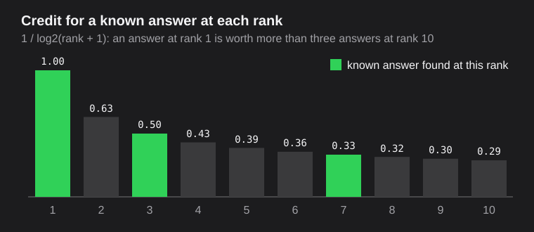
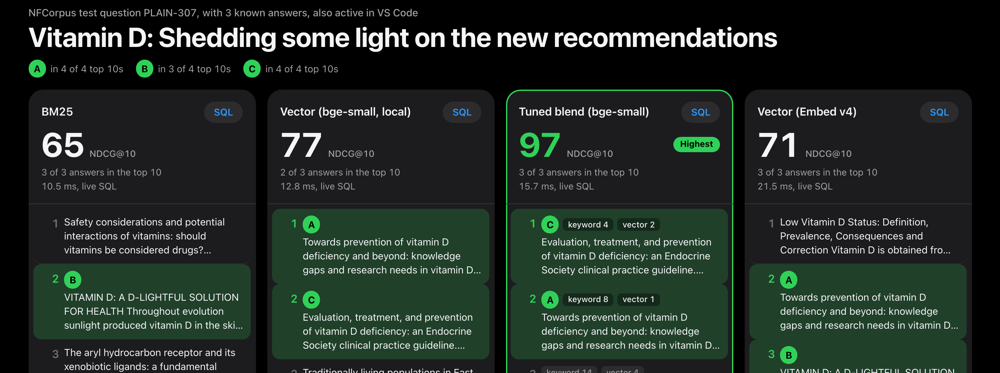
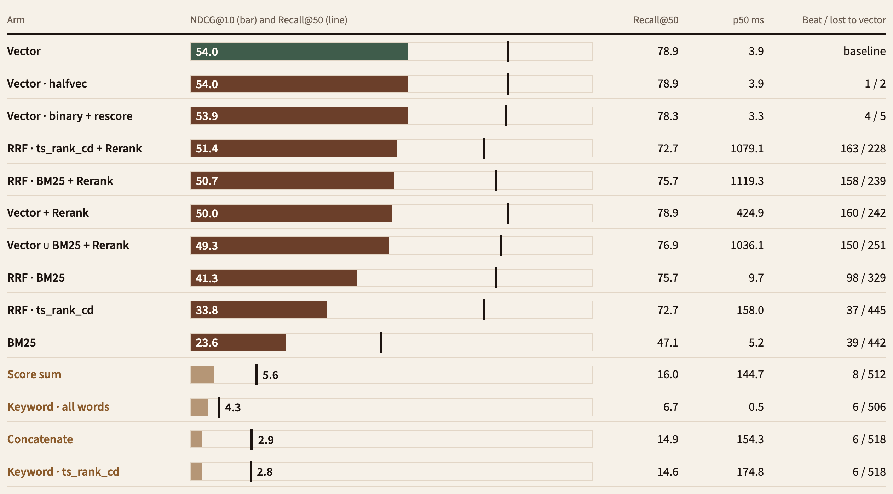

<!-- _class: title -->
<!-- _paginate: false -->

# Hybrid Search in PostgreSQL

## Combining Vector and Full-Text for Real-World Applications

<div class="byline">
Shayon Sanyal · Principal PostgreSQL Specialist SA · Lead, Agentic AI for Databases
</div>

<div class="meta">
Postgres Summit US 2026 · New York City<br>
September 30 · 10:30–11:20 EDT · Letterpress
</div>

<!--
Everything today runs in one local PostgreSQL 18.6 database and is graded against known
answers. Run of show and fallbacks: TALKING_POINTS.md. Demo: hybrid-lab/README.md.
-->

---

## Two questions. Two different misses.

<div class="journey-grid">
<div><span class="eyebrow">Keyword search misses</span><h3>“Where should I park my rainy-day / emergency fund?”</h3><p>The best answer is <strong>#2</strong> for vector search. Keyword search ranks it #29, BM25 #40, and requiring every word finds nothing.</p></div>
<div><span class="eyebrow">Vector search misses</span><h3>“Employer rollover from 403b to 401k?”</h3><p>The only answer is <strong>#1</strong> for BM25 and <strong>#26</strong> for vector search. Exact identifiers are what keyword search is for.</p></div>
</div>

**Words find exact terms. Vectors find paraphrases.** Which one wins, and whether combining
them helps, is a measurement, not a belief.

<!--
Both are real FiQA test questions, and both outcomes are measured in the lab. Read the first
question aloud, then say what keyword search returned. Same for the second. Then: today every
claim comes with a number.
-->

---

<!-- _class: bio -->
<!-- _paginate: false -->

<div class="bio-grid">
<div class="bio-photo">


</div>
<div class="bio-text">

## About me

# Shayon Sanyal

**Principal PostgreSQL Specialist Solutions Architect**
Tech Lead — Agentic AI for Databases

I help teams build on PostgreSQL, from relational applications to retrieval and agent workflows.

Today: readable SQL, measured results, and a skill you can point at your own tables.

<div class="bio-links">linkedin.com/in/shayonsanyal</div>

</div>
</div>

<!-- Keep the introduction to 20 seconds. -->

---

<!-- _class: split-evidence -->

## How we'll measure

<div class="evidence-grid">
<div>

# 2,271 questions with known right answers.

**FiQA-2018:** 57,638 finance forum posts, 648 test questions. The main example.

**SciFact, NFCorpus, SCIDOCS:** chosen by one rule before measuring: BEIR sets under
30,000 documents where BM25 beat every dense retriever in 2021.

**NDCG@10** scores a ranking higher when the known answers sit near the top.

</div>
<div class="evidence-image">



</div>
</div>

<!--
BEIR benchmark (Thakur et al., 2021). Test questions: FiQA 648, SciFact 300, NFCorpus 323,
SCIDOCS 1,000. Fusion weights are tuned only on each dataset's dev questions (SciFact: its
train split; SCIDOCS has none). Credit Dave Ebbelaar's tutorial for the FiQA-and-NDCG idea.
-->

---

## The stack: one PostgreSQL database

| Piece | Version | Job |
| --- | --- | --- |
| PostgreSQL | **18.6** | `tsvector`, GIN, `ts_rank_cd`, the fusion SQL, the scoring SQL |
| pgvector | **0.8.6** | `vector(1536)`, HNSW, iterative index scans, `halfvec`, `bit` |
| pg_textsearch | **1.4.0** | BM25 index and `<@>` operator (PostgreSQL license) |
| Cohere Embed v4 · Amazon Bedrock | 1536 dims | Posts as `search_document`, questions as `search_query` |
| Cohere Rerank · Amazon Bedrock | 3.5 | Reorders a top 50 outside the database |
| bge-small-en-v1.5 · fastembed | 384 dims | A small open-source model, on this laptop |
| VS Code + SQLTools | | Numbered SQL files you can run yourself |

Everything except the model calls is SQL. Every number today is from this laptop.

<!--
PostgreSQL 19 is in beta; not used. pg_textsearch is loaded from a project directory through
PostgreSQL 18's extension_control_path, not installed into Homebrew.
-->

---

<!-- _class: code-first -->

## One row, three representations · `01_schema.sql`

```sql
CREATE TABLE docs (
  id              text PRIMARY KEY,
  body            text NOT NULL,
  tsv             tsvector GENERATED ALWAYS AS (to_tsvector('english', body)) STORED,
  embedding       vector(1536),  -- Cohere Embed v4, input_type = 'search_document'
  embedding_local vector(384)    -- bge-small-en-v1.5, open source, local
);
CREATE INDEX ON docs USING gin (tsv);                                  --  0.6 s
CREATE INDEX ON docs USING hnsw (embedding vector_cosine_ops);          -- 30.4 s
CREATE INDEX ON docs USING bm25 (body) WITH (text_config = 'english'); --  3.9 s
```

The lexemes are **generated** and cannot drift from the text. Embeddings are not:
**one column per model**, re-embedded when the text changes.

<!--
Build times measured on 57,638 posts, M-series laptop, maintenance_work_mem = 1GB, 7 parallel
workers. m = 16 and ef_construction = 64 are pgvector's defaults.
-->

---

<!-- _class: code-first -->

## Pitfall 1: every word must match · `03`

```sql
SELECT websearch_to_tsquery('english', 'Where should I park my rainy-day / emergency fund?');
--  'park' & 'rainy-day' <-> 'raini' <-> 'day' & 'emerg' & 'fund'
```

`websearch_to_tsquery` and `plainto_tsquery` join words with **AND**. A natural question
rarely has all its words in one answer.

<p class="formula">405 of 648 questions match no post at all · NDCG@10 4.3</p>

<!--
Measured: keyword_and arm. Many tutorials, including the pgvectorscale hybrid-search example,
use exactly this call. Fine for a search box of product codes; wrong for questions.
-->

---

<!-- _class: code-first -->

## Match any word, rank the matches · `04`

```sql
WITH question AS (
  SELECT replace(plainto_tsquery('english', body)::text, ' & ', ' | ')::tsquery AS tsq
    FROM active_query
)
SELECT d.id, ts_rank_cd(d.tsv, q.tsq) AS score
  FROM docs d, question q
 WHERE d.tsv @@ q.tsq
 ORDER BY score DESC
 LIMIT 50;
```

Recall@50 doubles (6.7 → 14.6), but NDCG@10 **falls to 2.8**: with no IDF, “fund” and
“day” outweigh “rainy-day”. The rainy-day question matches **10,460 posts**, and
`ts_rank_cd` scores every one of them: **81 ms**.

<!--
EXPLAIN in 04: the planner picks a Seq Scan here. Forcing the GIN bitmap scan finds the 10,460
matches in about 3 ms and the query takes about 40 ms; ranking every match is the cost either
way. Medians of 9 runs.
ts_rank_cd scores each post alone: no corpus statistics, so "fund" weighs as much as "1099".
-->

---

<!-- _class: code-first -->

## `ts_rank_cd` is not BM25 · `05`

```sql
SELECT id, -(body <@> to_bm25query(:'question', 'docs_body_bm25')) AS bm25
  FROM docs
 ORDER BY body <@> to_bm25query(:'question', 'docs_body_bm25')
 LIMIT 50;
```

BM25 weighs rare terms up (IDF), saturates repeats, and normalizes for length. The index
keeps the corpus statistics and returns the top 50 **without scoring every match**.
23.6 is exactly BEIR's published BM25 score for FiQA (0.236).

| Keyword arm | NDCG@10 | Top 50, rainy-day question |
| --- | ---: | ---: |
| `ts_rank_cd`, any word | 2.8 | 81 ms |
| BM25, pg_textsearch | **23.6** | **0.27 ms** |

<!--
<@> returns the negative score so an ascending ORDER BY can use the index. Posts with none of
the terms score 0 and can fill the LIMIT; the lab filters them out. Check availability on your
platform before depending on it.
-->

---

<!-- _class: code-first -->

## Semantic candidates · `06`

```sql
SET hnsw.ef_search = 100;          -- default 40: LIMIT 50 would silently return 40
SELECT id, 1 - (embedding <=> (SELECT embedding FROM active_query)) AS cosine
  FROM docs
 WHERE embedding IS NOT NULL
 ORDER BY embedding <=> (SELECT embedding FROM active_query)
 LIMIT 50;
```

Keep the distance operator in `ORDER BY`, ascending, with a `LIMIT`. Embed questions as
`search_query` and posts as `search_document`.

NDCG@10 **53.9** · p50 **3.5 ms**

<!--
Pitfall 4 in the lab: an HNSW scan returns at most hnsw.ef_search rows. The test suite proves
it on this pgvector version. Posts without an embedding are excluded explicitly so sequential
and index plans agree.
-->

---

## Pitfall 2: adding scores from different scales · `07a` `07b`

| Rainy-day question, each list's top 50 | min | max |
| --- | ---: | ---: |
| `ts_rank_cd` | 1.70 | 5.40 |
| cosine similarity | 0.478 | 0.598 |

<table>
<thead><tr><th>Fusion</th><th style="text-align:right">NDCG@10</th></tr></thead>
<tbody data-marpit-fragment>
<tr><td><code>keyword_score + cosine</code></td><td style="text-align:right">5.6</td></tr>
<tr><td>keyword list, then vector list, duplicates removed</td><td style="text-align:right">2.9</td></tr>
</tbody>
<tbody data-marpit-fragment>
<tr><td><strong>Reciprocal Rank Fusion</strong> of the same two lists</td><td style="text-align:right"><strong>33.8</strong></td></tr>
</tbody>
</table>

<p data-marpit-fragment>Same inputs, 6× the score. Normalizing flags make <code>ts_rank_cd</code> bounded, not comparable.</p>

<!--
Three clicks: the two ways of mixing scores (5.6, 2.9), then RRF on the same lists (33.8), then
the punchline. The concatenation pattern is the one in the pgvectorscale hybrid-search branch:
it relies on a reranker afterwards. Without one, whichever list goes first wins.
-->

---

<!-- _class: rrf -->

## Fuse ranks, not scores

<p class="formula">RRF(d) = Σ 1 / (60 + rank<sub>list</sub>(d))</p>

<div class="rrf-demo">
<div class="rrf-lane bm25"><h4>BM25</h4><ol>
<li><span class="n">1</span><span class="pill top">66626</span></li>
<li><span class="n">2</span><span class="pill">371922</span></li>
<li><span class="n">3</span><span class="pill">569342</span></li>
<li><span class="n">4</span><span class="pill answer">32811<span>known answer</span></span></li>
<li><span class="n">5</span><span class="pill">2128</span></li>
<li><span class="n">6</span><span class="pill">32671</span></li>
<li><span class="n">7</span><span class="pill">404800</span></li>
<li><span class="n">8</span><span class="pill">266457</span></li>
<li><span class="n">9</span><span class="pill">272840</span></li>
<li><span class="n">10</span><span class="pill">65567</span></li>
</ol></div>
<div class="rrf-lane vector"><h4>Vector</h4><ol>
<li><span class="n">1</span><span class="pill top">293687</span></li>
<li><span class="n">2</span><span class="pill">348514</span></li>
<li><span class="n">3</span><span class="pill">469809</span></li>
<li><span class="n">4</span><span class="pill">361639</span></li>
<li><span class="n">5</span><span class="pill">458063</span></li>
<li><span class="n">6</span><span class="pill">427365</span></li>
<li><span class="n">7</span><span class="pill">209789</span></li>
<li><span class="n">8</span><span class="pill">283692</span></li>
<li><span class="n">9</span><span class="pill answer">32811<span>known answer</span></span></li>
<li><span class="n">10</span><span class="pill">62897</span></li>
</ol></div>
<div class="rrf-lane fused"><h4>RRF · fused</h4><ol>
<li><span class="n">1</span><span class="pill slot"></span></li>
<li><span class="n">2</span><span class="pill slot"></span></li>
<li><span class="n">3</span><span class="pill slot"></span></li>
<li><span class="n">4</span><span class="pill slot"></span></li>
<li><span class="n">5</span><span class="pill slot"></span></li>
<li><span class="n">6</span><span class="pill slot"></span></li>
<li><span class="n">7</span><span class="pill slot"></span></li>
<li><span class="n">8</span><span class="pill slot"></span></li>
<li><span class="n">9</span><span class="pill slot"></span></li>
<li><span class="n">10</span><span class="pill slot"></span></li>
</ol></div>
<div class="rrf-step" data-marpit-fragment>
<span class="pill answer fly from-bm25-4" style="top:37px">32811<span>known answer</span></span>
<span class="pill answer fly from-vector-9" style="top:37px">32811<span>known answer</span></span>
<p class="caption later" style="top:350px">Known answer: BM25 #4, vector #9 → 1/64 + 1/69 = <strong>0.03012</strong>, fused <strong>#1</strong>.</p>
</div>
<div class="rrf-step" data-marpit-fragment>
<span class="pill top fly from-vector-1" style="top:277px">293687<span class="score">0.01639</span></span>
<span class="pill top fly from-bm25-1" style="top:307px">66626<span class="score">0.01639</span></span>
<span class="pill placed later" style="top:67px">371922<span>0.02912</span></span>
<span class="pill placed later" style="top:97px">469809<span>0.02778</span></span>
<span class="pill placed later" style="top:127px">424427<span>0.02633</span></span>
<span class="pill placed later" style="top:157px">32671<span>0.02568</span></span>
<span class="pill placed later" style="top:187px">72960<span>0.02452</span></span>
<span class="pill placed later" style="top:217px">488737<span>0.02379</span></span>
<span class="pill placed later" style="top:247px">152096<span>0.02114</span></span>
<p class="caption later" style="top:382px">Each list's own #1 is missing from the other list: 1/61 = 0.01639, fused #9 and #10.</p>
</div>
</div>

<!--
Question 8512, "Is it possible to transfer stock I already own into my Roth IRA?". All rows
are real top 10s from the lab. Click 1: the known answer leaves BM25 #4 and vector #9 and lands
at fused #1. Neither list put it first; agreement did. Click 2: each list's own #1 drops to #9
and #10, and the rest of the fused list fills in. Missing from a list contributes 0. k = 60
comes from Cormack, Clarke and Büttcher (SIGIR 2009).
-->

---

<!-- _class: code-first dense -->

## RRF is a full outer join · `08a`

```sql
WITH keyword AS (
  SELECT id, row_number() OVER (ORDER BY ts_rank_cd(tsv, q) DESC, id) AS rank
    FROM docs, (SELECT replace(plainto_tsquery('english', :'question')::text,
                                ' & ', ' | ')::tsquery AS q) question
   WHERE tsv @@ q ORDER BY rank LIMIT 50
),
semantic AS (
  SELECT id, row_number() OVER (ORDER BY distance, id) AS rank
    FROM (SELECT id, embedding <=> :'question_embedding' AS distance
            FROM docs WHERE embedding IS NOT NULL
           ORDER BY distance LIMIT 50) nearest
)
SELECT coalesce(k.id, v.id) AS id,
       coalesce(1.0 / (60 + k.rank), 0) + coalesce(1.0 / (60 + v.rank), 0) AS rrf
  FROM keyword k FULL OUTER JOIN semantic v USING (id)
 ORDER BY rrf DESC
 LIMIT 10;
```

One statement, two indexes (GIN and HNSW). p50 **150 ms** with `ts_rank_cd`; **8.2 ms** with BM25 as the keyword list (`08b`).

<!--
The lab file reads the question from the active_query view and exposes weights in a settings
CTE. EXPLAIN shows Bitmap Index Scan on docs_tsv_gin and Index Scan using docs_embedding_hnsw.
-->

---

<!-- _class: code-first dense -->

## Blend scores the right way · `08c`

```sql
keyword_norm AS (        -- per question: min-max to [0, 1]; semantic_norm is the same
  SELECT id, (score - min(score) OVER ()) / (max(score) OVER () - min(score) OVER ()) AS s
    FROM keyword
)
SELECT id, w * coalesce(v.s, 0) + (1 - w) * coalesce(k.s, 0) AS blend
  FROM keyword_norm k FULL OUTER JOIN semantic_norm v USING (id);
```

RRF ignores how **confident** each list is. A normalized blend keeps it, and is what
“adding scores” should have been in pitfall 2.

| Weight `w` on vector, tuned on **dev** questions only | FiQA | SciFact | NFCorpus | SCIDOCS |
| --- | ---: | ---: | ---: | ---: |
| Cohere Embed v4 (frontier) | **1.0** | 0.70 | 0.70 | 0.5, untuned |
| bge-small (local) | 0.65 | 0.55 | 0.65 | 0.5, untuned |

<!--
Bruch, Gai & Ingber, "An Analysis of Fusion Functions for Hybrid Retrieval", ACM TOIS 2023.
The weight lives in fusion_settings; py/5_tune_fusion.py chooses it on held-out questions and
never sees the test set. On FiQA it chooses pure vector: the data can say "don't blend".
-->

---

## Knobs that change different things

| Knob | Controls | Watch |
| --- | --- | --- |
| **Candidate depth** (50) | How many posts each list contributes | A post outside both lists can't be fused or reranked: **Recall@50** |
| **k** (60) | How fast credit falls with rank | Smaller k favors each list's top few |
| **Weights** | Trust in each list | Equal-weight RRF lost to vector on all four datasets; tune a blend on dev questions instead |
| **`hnsw.ef_search`** (100) | Work per HNSW scan | Must be ≥ the candidate depth |

Change one at a time, and re-run the test questions.

<!--
Depth and ef_search are different things: depth is a LIMIT, ef_search bounds the HNSW
candidate queue.
-->

---

<!-- _class: demo-slide -->

## Live · NFCorpus · all local except the last column

# Small model + BM25 beat the frontier model here



<p class="stage-url">localhost:8018 · pick NFCorpus · “Local hybrid beats the frontier model”</p>

<!--
Question: "Vitamin D: Shedding some light on the new recommendations" (3 known answers).
BM25 65, bge-small alone 77, tuned blend of the two 97, Cohere Embed v4 alone 71. Hover the
answer letters to follow each paper across columns; the blend's rows show each paper's rank in
both lists. Open SQL on the blend column: 08e, the same query as 08c with the local column.
This is one question; the averages are on the next slides. Then switch the header to FiQA and
open "Keyword wins" (403b to 401k) to show BM25 #1 against vector #26.
-->
---

## From text to vector

- **Cohere Embed v4** on Amazon Bedrock: 1536 dimensions, unit-length vectors, so cosine
  distance and inner product rank the same way.
- **Two input types.** Posts are embedded as `search_document`, questions as
  `search_query`. Swapping them lowers relevance without any error.
- **One model per column.** Vectors from different models or versions are not comparable,
  even at the same dimension. Store the model id.
- **A small local model too:** bge-small-en-v1.5, 384 dims, open source, in its own
  column. FiQA's 57,638 posts took about an hour on the laptop CPU; Embed v4 took 35 minutes
  behind a tokens-per-minute quota. Resume on NULLs either way.

<!--
Blank posts (38 in FiQA) cannot be embedded and stay NULL. One judged answer is a blank post,
so no arm can ever find it.
-->

---

<!-- _class: code-first -->

## Pitfall 3: a filter is not a pre-filter · `09`

```sql
SELECT id FROM docs
 WHERE tsv @@ plainto_tsquery('english', 'mortgage')      -- 4.2% of posts
 ORDER BY embedding <=> :'question_embedding' LIMIT 10;
```

| Setting | Plan | Rows returned |
| --- | --- | ---: |
| defaults (`iterative_scan = off`, `ef_search = 40`) | HNSW, then filter: **Rows Removed by Filter: 39** | **1 of 10** |
| `SET hnsw.iterative_scan = relaxed_order` | HNSW keeps walking until 10 pass | 10 of 10 |
| a rare term: `heloc` (0.2%) | GIN, then exact sort | 10 of 10 |

pgvector 0.8 iterative scans are bounded by `hnsw.max_scan_tuples` (20,000).

<!--
Question 988, "Where should I invest my savings?". 1 + 39 = 40 = ef_search. The exact split
varies between index builds (an earlier build returned 2 and removed 38). The planner chose
HNSW for mortgage and GIN for heloc on its own; check EXPLAIN rather than assume.
-->

---

<!-- _class: code-first -->

## Similar to the question AND contains a word · `11`

```sql
SELECT h.*, left(d.body, 60)
  FROM hybrid_search(:'question', :'question_embedding',
                     match_count => 5, required_terms => 'mortgage') h
  JOIN docs d ON d.id = h.doc_id;
```

```sql
CREATE FUNCTION hybrid_search(...) ... LANGUAGE sql STABLE
  SET hnsw.ef_search = 100
  SET hnsw.iterative_scan = relaxed_order
  SET plan_cache_mode = force_custom_plan   -- keeps "required_terms IS NULL OR ..." indexable
```

The requirement goes into **both** candidate lists, before their LIMIT.

<!--
The last setting was found by measurement. Planned generically, the optional filter hides the
HNSW index and the vector list becomes a parallel sequential scan: 197 ms instead of 73 ms with
no filter, 67 ms instead of 15 ms with 'mortgage' (question 988, medians of 7 calls).
auto_explain shows the plans inside the function.
-->

---

<!-- _class: gold -->

## Hybrid vs vector, same embedding model · NDCG@10 change on 2,271 test questions

<table class="gold-table">
<thead><tr><th></th><th>FiQA</th><th>SciFact</th><th>NFCorpus</th><th>SCIDOCS</th></tr></thead>
<tbody data-marpit-fragment>
<tr class="section"><td colspan="5">Small local model · bge-small, 384 dims, on this laptop</td></tr>
<tr><td>Tuned blend + BM25</td><td class="up">+1.2 ↑<small>+0.4…+2.1</small></td><td class="up">+2.1 ↑<small>+0.0…+4.3</small></td><td class="up">+2.1 ↑<small>+1.3…+3.0</small></td><td>+0.2 *<small>−0.5…+0.8</small></td></tr>
<tr><td>Equal-weight RRF + BM25</td><td class="down">−3.1 ↓<small>−4.7…−1.5</small></td><td>+1.7<small>−0.9…+4.3</small></td><td class="up">+2.3 ↑<small>+1.0…+3.7</small></td><td>−0.3<small>−1.0…+0.5</small></td></tr>
</tbody>
<tbody data-marpit-fragment>
<tr class="section"><td colspan="5">Frontier model · Cohere Embed v4, 1536 dims</td></tr>
<tr><td>Tuned blend + BM25</td><td>0.0<small>chose w = 1</small></td><td>+0.2<small>−1.2…+1.4</small></td><td class="up">+0.8 ↑<small>+0.1…+1.5</small></td><td class="down">−0.8 ↓ *<small>−1.4…−0.2</small></td></tr>
<tr><td>Equal-weight RRF + BM25</td><td class="down">−12.5 ↓<small>−14.5…−10.6</small></td><td class="down">−2.9 ↓<small>−5.1…−0.6</small></td><td>−1.1<small>−2.2…+0.1</small></td><td class="down">−1.2 ↓<small>−2.0…−0.5</small></td></tr>
<tr><td>Cohere Rerank 3.5, top 50</td><td class="down">−4.1 ↓<small>−6.0…−2.3</small></td><td>−0.4<small>−2.8…+1.9</small></td><td class="down">−1.9 ↓<small>−3.3…−0.4</small></td><td>−0.4<small>−1.1…+0.3</small></td></tr>
</tbody>
</table>

<p class="caption">↑ / ↓: 95% paired bootstrap interval above / below zero · * SCIDOCS has no dev questions, so its blend weight is an untuned 0.5 · results/summary.md</p>

<!--
Two clicks: the small local model first, then the frontier model. Small local model: a tuned blend beats vector on three of four datasets,
significantly, and never loses. Frontier model: equal-weight RRF, the tutorial default, never
beats vector and loses significantly on three datasets; a tuned blend wins only on NFCorpus
(+0.8). SCIDOCS shows why tuning matters: with no dev questions the blend used 0.5 and lost.
No rerank arm beat vector significantly on any dataset (SciFact's best was +0.4, inside the noise). Baselines (vector alone): small 38.0 / 72.0 / 33.8 / 19.6;
frontier 53.9 / 77.5 / 40.1 / 20.6. Weights were tuned on each dataset's dev questions only.
-->

---

## When hybrid pays: a smaller model

| NDCG@10 | FiQA | SciFact | NFCorpus | SCIDOCS |
| --- | ---: | ---: | ---: | ---: |
| bge-small alone · local, open source | 38.0 | 72.0 | 33.8 | 19.6 |
| **bge-small + BM25, tuned blend · all local** | **39.2** | **74.2** | **35.9** | 19.8 |
| Cohere Embed v4 alone · frontier API | 53.9 | 77.5 | 40.1 | 20.6 |
| **Share of the gap closed by BM25** | 8% | **39%** | **33%** | not significant |

PostgreSQL, BM25, and a 384-dimension model on one laptop, no API calls: adding keyword search
closes **a third or more of the gap** to a frontier model on SciFact and NFCorpus.

<!--
The honest framing: a better embedding model beats hybrid on a small one. But if you run local
or open-source models for cost, privacy, or latency, BM25 in PostgreSQL is cheap and measurably
helps. Live example (NFCorpus): "Vitamin D: Shedding some light on the new recommendations",
small vector 77, BM25 65, tuned blend 97, Embed v4 alone 71.
-->

---

## Rerank: measure it too · FiQA

| Candidates sent to Cohere Rerank 3.5 | NDCG@10 | Recall@50 | p50 |
| --- | ---: | ---: | ---: |
| none: vector alone | **53.9** | 78.5 | **3.5 ms** |
| vector top 50 | 49.7 | 78.5 | 417 ms |
| RRF · BM25 top 50 | 50.4 | 75.2 | 1,093 ms |
| vector ∪ BM25, up to 100 | 49.0 | 76.5 | 1,208 ms |

It lifts 403b from #26 to #2, but puts a known answer first on 47.5% of questions against 53.9% for Embed v4 alone. On no dataset did a reranked arm beat vector by more than noise.

- A reranker reads the question and each candidate **together**, but can only reorder what the lists found: Recall@50 is its ceiling.
- It runs **outside PostgreSQL**: a network call per question, and the candidates' text leaves the database.

<!--
Not a bug: rerank scores separate answers from non-answers (0.55 vs 0.26 on average). On this
benchmark, this embedding model is simply better at the top ranks than this reranker. p50 here
was measured with 8 concurrent calls from a laptop. Models improve; measure the pair you use.
-->

---

## Storage: the same vectors, smaller · FiQA

| Index on `embedding` | Bytes per vector | HNSW size | NDCG@10 | p50 ms |
| --- | ---: | ---: | ---: | ---: |
| `vector(1536)` | 6,148 | 450 MB | 53.9 | 3.5 |
| `halfvec(1536)` expression index | 3,080 | 225 MB | 53.7 | 3.4 |
| `binary_quantize()` + rescore 200 | 200 | 28 MB | 54.1 | 3.3 |

Half the index for the same NDCG within noise; 1/16 with binary plus a rescore. The table keeps full-precision vectors; only the index shrinks.

<!--
12a and 12b. Binary quantization keeps the sign of each dimension; the query takes 200 Hamming
candidates and re-orders them by exact cosine distance on the full vectors.
-->

---

<!-- _class: dense -->

## What these numbers do and don't prove

| They show | They don't show |
| --- | --- |
| Which arm ranks judged answers higher on four public datasets | That the same holds for your data |
| The pitfalls, reproduced with real plans | Production latency: this is one laptop, one client |
| Relative cost of each arm on up to 57,638 documents | Behavior at 50 million rows or under concurrency |
| This embedding and rerank model pair | Future models: they improve, and results depend on the model versions used |
| A public benchmark | That the models never saw similar text in training |
| Two embedding models, one reranker | How other models behave; SCIDOCS blends are untuned (no dev split) |

BEIR judgments are incomplete: an unjudged document can be a good answer and still count as a miss.

<!--
Every arm is penalized equally by unjudged answers. Compare arms against each other, not
against another benchmark's numbers.
-->

---

<!-- _class: takeaway -->

## Three things to take home

# Rank words with BM25.<br>Blend, tuned on held-out questions.<br>Hybrid pays most on smaller models.

Local model + BM25: **+1.2 to +2.1 NDCG@10 on three of four datasets**. Frontier model: equal-weight RRF never won. **Measure on your own questions before you choose.**

<!--
Keyword search earns its place for exact identifiers (403b/401k), as a required-term filter
(09, 11), and as a partner to a smaller embedding model. Blind equal-weight fusion does not.
-->

---

<!-- _class: split-evidence -->

## Take it home

<div class="evidence-grid">
<div>

**The lab:** `hybrid-lab/`. Numbered SQL, VS Code cells, the UI, and the scoreboard.

**The skill:** adds hybrid search to *your* table and measures it.

```text
/plugin marketplace add shayons/talks
/plugin install postgres-hybrid-search@shayons-talks
```

Other agents: copy `hybrid-search-plugin/skills/postgres-hybrid-search/`.

</div>
<div class="evidence-image qr">


</div>
</div>

<p class="caption">github.com/shayons/talks · conferences/2026-postgresconf-agentic-ai</p>

<!--
The skill inspects the table, proposes the migration and waits for approval, backfills
embeddings, installs the function, and evaluates it with labeled or synthetic questions.
-->

---

<!-- _class: thanks -->
<!-- _paginate: false -->

# Thank you.

Which of your queries needs both words and meaning?

Shayon Sanyal · linkedin.com/in/shayonsanyal

[github.com/shayons/talks](https://github.com/shayons/talks)

<!--
Six minutes for questions. Appendix: operating the workload and references.
-->

---

## Appendix · operate the measured workload

| Area | Inspect before changing it |
| --- | --- |
| **HNSW build** | `maintenance_work_mem` (graph must fit), parallel workers, `m`, `ef_construction`, index size |
| **HNSW search** | `ef_search` ≥ LIMIT, filtered recall, `iterative_scan`, `max_scan_tuples` |
| **Full text** | OR vs AND queries, match counts, `ts_rank_cd` cost on common terms, BM25 availability |
| **Embeddings** | Model id per column, input types, re-embedding on text change, quota and throttling |
| **Functions** | Inner plans with `auto_explain`; `plan_cache_mode` for optional filters |
| **Evaluation** | Re-run the question set after every change; keep per-question wins and losses |

<!--
No universal ef_search-to-recall table or row-count cutoff is established by this lab.
-->

---

<!-- _class: diagram-slide -->

## Appendix · FiQA scoreboard, every arm



<p class="caption">Bar: NDCG@10 · line: Recall@50 · laptop latency, rerank rows include Bedrock calls · results/scoreboard-fiqa.md</p>

<!--
Read it top down. On FiQA, one Embed v4 vector query (53.9, 3.5 ms) matches or beats every
hybrid and every reranked variant; binary + rescore (54.1) is the same within noise, and the
tuned blend chose w = 1.0, pure vector. RRF with BM25 beats vector on 98 questions and loses on
325. Even on the 177 questions that contain a number or an acronym, vector wins (57.7 vs 46.5).
The pitfalls sit at the bottom: adding scores 5.6, all-words 4.3, concatenation 2.9,
ts_rank_cd any-word 2.8.
-->

---

<!-- _class: references -->

## References

- **PostgreSQL 18:** [Full-text search](https://www.postgresql.org/docs/18/textsearch.html), [Using EXPLAIN](https://www.postgresql.org/docs/18/using-explain.html), [auto_explain](https://www.postgresql.org/docs/18/auto-explain.html)
- **pgvector 0.8.6:** [HNSW, filtering, iterative index scans](https://github.com/pgvector/pgvector) · **pg_textsearch 1.4.0:** [BM25 for PostgreSQL](https://github.com/timescale/pg_textsearch)
- **RRF:** Cormack, Clarke & Büttcher, [SIGIR 2009](https://doi.org/10.1145/1571941.1572114) · **HNSW:** Malkov & Yashunin, [arXiv:1603.09320](https://arxiv.org/abs/1603.09320)
- **Score blending:** Bruch, Gai & Ingber, “An Analysis of Fusion Functions for Hybrid Retrieval”, [ACM TOIS 2023](https://doi.org/10.1145/3596512) · **bge-small-en-v1.5:** [BAAI, MIT license](https://huggingface.co/BAAI/bge-small-en-v1.5), run with [fastembed](https://github.com/qdrant/fastembed)
- **FiQA-2018, SciFact, NFCorpus, SCIDOCS** via [BEIR](https://github.com/beir-cellar/beir) (Thakur et al., NeurIPS 2021) · Dave Ebbelaar, [hybrid-retrieval tutorial](https://github.com/daveebbelaar/ai-cookbook/tree/main/knowledge/hybrid-retrieval) (the FiQA + NDCG approach this lab moves into PostgreSQL)
- **This talk:** `hybrid-lab/sql/`, `hybrid-lab/results/`, `hybrid-search-plugin/`

<p class="caption">Measured on PostgreSQL 18.6, pgvector 0.8.6, pg_textsearch 1.4.0 · September 2026</p>
