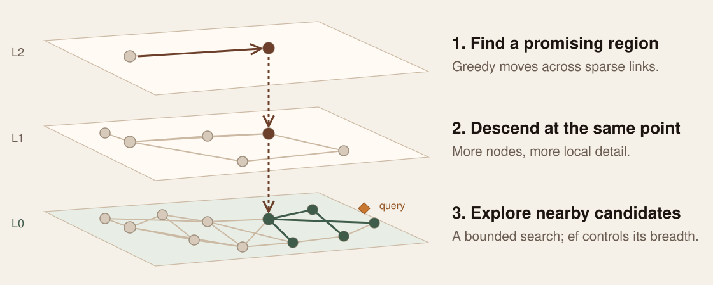

<!-- _class: title -->
<!-- _paginate: false -->

# Hybrid Search in PostgreSQL

## Combining Vector and Full-Text for Real-World Applications

<div class="byline">
Shayon Sanyal · Principal PostgreSQL Specialist SA · Lead, Agentic AI for Databases
</div>

<div class="meta">
Postgres Summit US 2026 · New York City<br>
September 30 · 10:30–11:20 EDT · Letterpress
</div>

<!--
Everything today runs in one local PostgreSQL 18.6 database and is graded against known
answers. Run of show and fallbacks: TALKING_POINTS.md. Demo: hybrid-lab/README.md.
-->

---

## Two questions. Two different misses.

<div class="journey-grid">
<div><span class="eyebrow">Keyword search misses</span><h3>“Where should I park my rainy-day / emergency fund?”</h3><p>The best answer is <strong>#2</strong> for vector search. Keyword search ranks it #29, BM25 #40, and requiring every word finds nothing.</p></div>
<div><span class="eyebrow">Vector search misses</span><h3>“Employer rollover from 403b to 401k?”</h3><p>The only answer is <strong>#1</strong> for BM25 and <strong>#26</strong> for vector search. Exact identifiers are what keyword search is for.</p></div>
</div>

**Words find exact terms. Vectors find paraphrases.** Which one wins, and whether combining
them helps, is a measurement, not a belief.

<!--
Both are real FiQA test questions, and both outcomes are measured in the lab. Read the first
question aloud, then say what keyword search returned. Same for the second. Then: today every
claim comes with a number.
-->

---

<!-- _class: bio -->
<!-- _paginate: false -->

<div class="bio-grid">
<div class="bio-photo">


</div>
<div class="bio-text">

## About me

# Shayon Sanyal

**Principal PostgreSQL Specialist Solutions Architect**
Tech Lead — Agentic AI for Databases

I help teams build on PostgreSQL, from relational applications to retrieval and agent workflows.

Today: readable SQL, measured results, and a skill you can point at your own tables.

<div class="bio-links">linkedin.com/in/shayonsanyal</div>

</div>
</div>

<!-- Keep the introduction to 20 seconds. -->

---

<!-- _class: split-evidence -->

## How we'll measure

<div class="evidence-grid">
<div>

# 648 questions with known right answers.

FiQA-2018: **57,638** real finance forum posts. Human judges marked which posts answer
each of **648** test questions (**1,706** judgments).

**NDCG@10** scores a ranking higher when those answers sit near the top.
100 means every answer is first; 0 means none is in the top 10.

</div>
<div class="evidence-image">


</div>
</div>

<!--
BEIR benchmark, same corpus as Dave Ebbelaar's hybrid-retrieval tutorial. We average over all
648 questions; a question an arm returns nothing for scores 0. Recall@50 comes later.
-->

---

## The stack: one PostgreSQL database

| Piece | Version | Job |
| --- | --- | --- |
| PostgreSQL | **18.6** | `tsvector`, GIN, `ts_rank_cd`, the fusion SQL, the scoring SQL |
| pgvector | **0.8.6** | `vector(1536)`, HNSW, iterative index scans, `halfvec`, `bit` |
| pg_textsearch | **1.4.0** | BM25 index and `<@>` operator (PostgreSQL license) |
| Cohere Embed v4 · Amazon Bedrock | 1536 dims | Posts as `search_document`, questions as `search_query` |
| Cohere Rerank · Amazon Bedrock | 3.5 | Reorders a top 50 outside the database |
| VS Code + SQLTools | | Numbered SQL files you can run yourself |

Everything except the two model calls is SQL. Every number today is from this laptop.

<!--
PostgreSQL 19 is in beta; not used. pg_textsearch is loaded from a project directory through
PostgreSQL 18's extension_control_path, not installed into Homebrew.
-->

---

<!-- _class: code-first -->

## One row, three representations · `01_schema.sql`

```sql
CREATE TABLE docs (
  id        text PRIMARY KEY,
  body      text NOT NULL,
  tsv       tsvector GENERATED ALWAYS AS (to_tsvector('english', body)) STORED,
  embedding vector(1536)       -- Cohere Embed v4, input_type = 'search_document'
);
CREATE INDEX ON docs USING gin (tsv);                                  --  0.6 s
CREATE INDEX ON docs USING hnsw (embedding vector_cosine_ops);          -- 30.4 s
CREATE INDEX ON docs USING bm25 (body) WITH (text_config = 'english'); --  3.9 s
```

The lexemes are **generated** and cannot drift from the text. The embedding is not:
re-embed when the text or the model changes.

<!--
Build times measured on 57,638 posts, M-series laptop, maintenance_work_mem = 1GB, 7 parallel
workers. m = 16 and ef_construction = 64 are pgvector's defaults.
-->

---

<!-- _class: code-first -->

## Pitfall 1: every word must match · `03`

```sql
SELECT websearch_to_tsquery('english', 'Where should I park my rainy-day / emergency fund?');
--  'park' & 'rainy-day' <-> 'raini' <-> 'day' & 'emerg' & 'fund'
```

`websearch_to_tsquery` and `plainto_tsquery` join words with **AND**. A natural question
rarely has all its words in one answer.

<p class="formula">405 of 648 questions match no post at all · NDCG@10 4.3</p>

<!--
Measured: keyword_and arm. Many tutorials, including the pgvectorscale hybrid-search example,
use exactly this call. Fine for a search box of product codes; wrong for questions.
-->

---

<!-- _class: code-first -->

## Match any word, rank the matches · `04`

```sql
WITH question AS (
  SELECT replace(plainto_tsquery('english', body)::text, ' & ', ' | ')::tsquery AS tsq
    FROM active_query
)
SELECT d.id, ts_rank_cd(d.tsv, q.tsq) AS score
  FROM docs d, question q
 WHERE d.tsv @@ q.tsq
 ORDER BY score DESC
 LIMIT 50;
```

Recall@50 doubles (6.7 → 14.6), but NDCG@10 **falls to 2.8**: with no IDF, “fund” and
“day” outweigh “rainy-day”. The rainy-day question matches **10,460 posts**, and
`ts_rank_cd` scores every one of them: **115 ms**.

<!--
EXPLAIN in 04 shows the Bitmap Index Scan on GIN is fast (6 ms); ranking is the cost.
ts_rank_cd scores each post alone: no corpus statistics, so "fund" weighs as much as "1099".
-->

---

<!-- _class: code-first -->

## `ts_rank_cd` is not BM25 · `05`

```sql
SELECT id, -(body <@> to_bm25query(:'question', 'docs_body_bm25')) AS bm25
  FROM docs
 ORDER BY body <@> to_bm25query(:'question', 'docs_body_bm25')
 LIMIT 50;
```

BM25 weighs rare terms up (IDF), saturates repeats, and normalizes for length. The index
keeps the corpus statistics and returns the top 50 **without scoring every match**.
23.6 is in line with published BM25 results on FiQA (23.6–24.4).

| Keyword arm | NDCG@10 | Top 50, rainy-day question |
| --- | ---: | ---: |
| `ts_rank_cd`, any word | 2.8 | 115 ms |
| BM25, pg_textsearch | **23.6** | **0.56 ms** |

<!--
<@> returns the negative score so an ascending ORDER BY can use the index. Posts with none of
the terms score 0 and can fill the LIMIT; the lab filters them out. Check availability on your
platform before depending on it.
-->

---

<!-- _class: code-first -->

## Semantic candidates · `06`

```sql
SET hnsw.ef_search = 100;          -- default 40: LIMIT 50 would silently return 40
SELECT id, 1 - (embedding <=> (SELECT embedding FROM active_query)) AS cosine
  FROM docs
 WHERE embedding IS NOT NULL
 ORDER BY embedding <=> (SELECT embedding FROM active_query)
 LIMIT 50;
```

Keep the distance operator in `ORDER BY`, ascending, with a `LIMIT`. Embed questions as
`search_query` and posts as `search_document`.

NDCG@10 **54.0** · p50 **3.9 ms**

<!--
Pitfall 4 in the lab: an HNSW scan returns at most hnsw.ef_search rows. The test suite proves
it on this pgvector version. Posts without an embedding are excluded explicitly so sequential
and index plans agree.
-->

---

## Pitfall 2: adding scores from different scales · `07a` `07b`

| Rainy-day question, each list's top 50 | min | max |
| --- | ---: | ---: |
| `ts_rank_cd` | 1.70 | 5.40 |
| cosine similarity | 0.478 | 0.598 |

| Fusion | NDCG@10 |
| --- | ---: |
| `keyword_score + cosine` | 5.6 |
| keyword list, then vector list, duplicates removed | 2.9 |
| **Reciprocal Rank Fusion** of the same two lists | **33.8** |

Same inputs, 6× the score. Normalizing flags make `ts_rank_cd` bounded, not comparable.

<!--
The concatenation pattern is the one in the pgvectorscale hybrid-search branch: it relies on
a reranker afterwards. Without one, whichever list goes first wins.
-->

---

## Fuse ranks, not scores

<p class="formula">RRF(d) = Σ 1 / (60 + rank<sub>list</sub>(d))</p>

| “Transfer stock I own into my Roth IRA?” (FiQA 8512) | BM25 rank | Vector rank | RRF | Fused |
| --- | ---: | ---: | ---: | ---: |
| **The known answer** | 4 | 9 | 1/64 + 1/69 = **0.03012** | **#1** |
| Another post | 2 | 17 | 1/62 + 1/77 = 0.02912 | #2 |
| Another post | 24 | 3 | 1/84 + 1/63 = 0.02778 | #3 |
| Vector's #1 | — | 1 | 0 + 1/61 = 0.01639 | #9 |

Missing from a list contributes **0**. Agreement between lists wins; no score scales involved.

<!--
Rows are real: the top of the RRF · BM25 list for this question, from 08b. Neither list put
the answer first; agreement did. k = 60 comes from Cormack, Clarke and Büttcher (SIGIR 2009).
-->

---

<!-- _class: code-first dense -->

## RRF is a full outer join · `08a`

```sql
WITH keyword AS (
  SELECT id, row_number() OVER (ORDER BY ts_rank_cd(tsv, q) DESC, id) AS rank
    FROM docs, (SELECT replace(plainto_tsquery('english', :'question')::text,
                                ' & ', ' | ')::tsquery AS q) question
   WHERE tsv @@ q ORDER BY rank LIMIT 50
),
semantic AS (
  SELECT id, row_number() OVER (ORDER BY distance, id) AS rank
    FROM (SELECT id, embedding <=> :'question_embedding' AS distance
            FROM docs WHERE embedding IS NOT NULL
           ORDER BY distance LIMIT 50) nearest
)
SELECT coalesce(k.id, v.id) AS id,
       coalesce(1.0 / (60 + k.rank), 0) + coalesce(1.0 / (60 + v.rank), 0) AS rrf
  FROM keyword k FULL OUTER JOIN semantic v USING (id)
 ORDER BY rrf DESC
 LIMIT 10;
```

One statement, two indexes (GIN and HNSW). p50 **158 ms** with `ts_rank_cd`; **9.7 ms** with BM25 as the keyword list (`08b`).

<!--
The lab file reads the question from the active_query view and exposes weights in a settings
CTE. EXPLAIN shows Bitmap Index Scan on docs_tsv_gin and Index Scan using docs_embedding_hnsw.
-->

---

## Knobs that change different things

| Knob | Controls | Watch |
| --- | --- | --- |
| **Candidate depth** (50) | How many posts each list contributes | A post outside both lists can't be fused or reranked: **Recall@50** |
| **k** (60) | How fast credit falls with rank | Smaller k favors each list's top few |
| **Weights** (1.0 / 1.0) | Trust in each list | FiQA, RRF · BM25: 41.3 at 1.0, 52.0 at 0.1. Never above vector alone (54.0) |
| **`hnsw.ef_search`** (100) | Work per HNSW scan | Must be ≥ the candidate depth |

Change one at a time, and re-run the 648 questions.

<!--
Depth and ef_search are different things: depth is a LIMIT, ef_search bounds the HNSW
candidate queue.
-->

---

<!-- _class: demo-slide -->

## Live

# Same question, every arm, graded


<p class="stage-url">localhost:8018 · hybrid-lab/README.md</p>

<!--
Pick the rainy-day question. Point at the answer letters: which columns found A, B, C, and at
what rank. Hover a row to follow a post across columns. Open SQL on the hybrid column: the
dimmed part is exploration; below the marker is exactly what ran.
-->

---

## From text to vector

- **Cohere Embed v4** on Amazon Bedrock: 1536 dimensions, unit-length vectors, so cosine
  distance and inner product rank the same way.
- **Two input types.** Posts are embedded as `search_document`, questions as
  `search_query`. Swapping them lowers relevance without any error.
- **One model per column.** Vectors from different models or versions are not comparable,
  even at the same dimension. Store the model id.
- **Cost of the corpus:** 7.7M words, one pass, about 35 minutes behind a
  tokens-per-minute quota. Resume on NULLs; wait out throttling.

<!--
Blank posts (38 in FiQA) cannot be embedded and stay NULL. One judged answer is a blank post,
so no arm can ever find it.
-->

---

<!-- _class: diagram-slide -->

## HNSW: navigate broadly, then search locally



<p class="caption">Conceptual hierarchy · ef_search bounds the base-layer candidate queue</p>

<!--
Start at a sparse upper layer, move greedily toward the query, descend, then run a bounded
best-first search at layer zero. ef_search is the size of that bound; it also caps how many
rows one scan can return.
-->

---

<!-- _class: code-first -->

## Pitfall 3: a filter is not a pre-filter · `09`

```sql
SELECT id FROM docs
 WHERE tsv @@ plainto_tsquery('english', 'mortgage')      -- 4.2% of posts
 ORDER BY embedding <=> :'question_embedding' LIMIT 10;
```

| Setting | Plan | Rows returned |
| --- | --- | ---: |
| defaults (`iterative_scan = off`, `ef_search = 40`) | HNSW, then filter: **Rows Removed by Filter: 38** | **2 of 10** |
| `SET hnsw.iterative_scan = relaxed_order` | HNSW keeps walking until 10 pass | 10 of 10 |
| a rare term: `heloc` (0.2%) | GIN, then exact sort | 10 of 10 |

pgvector 0.8 iterative scans are bounded by `hnsw.max_scan_tuples` (20,000).

<!--
Question 988, "Where should I invest my savings?". 2 + 38 = 40 = ef_search. The planner chose
HNSW for mortgage and GIN for heloc on its own; check EXPLAIN rather than assume.
-->

---

<!-- _class: code-first -->

## Similar to the question AND contains a word · `11`

```sql
SELECT h.*, left(d.body, 60)
  FROM hybrid_search(:'question', :'question_embedding',
                     match_count => 5, required_terms => 'mortgage') h
  JOIN docs d ON d.id = h.doc_id;
```

```sql
CREATE FUNCTION hybrid_search(...) ... LANGUAGE sql STABLE
  SET hnsw.ef_search = 100
  SET hnsw.iterative_scan = relaxed_order
  SET plan_cache_mode = force_custom_plan   -- keeps "required_terms IS NULL OR ..." indexable
```

The requirement goes into **both** candidate lists, before their LIMIT.

<!--
The last setting was found by measurement: planned generically, the optional filter disabled
both indexes and the call took 335 ms instead of 86 ms. auto_explain showed the sequential
scans inside the function.
-->

---

## Read the plan that actually ran

```text
Limit (actual rows=2)
  ->  Index Scan using docs_embedding_hnsw on docs (actual rows=2)
        Order By: (embedding <=> (InitPlan 1).col1)
        Filter: (tsv @@ '''mortgag'''::tsquery)
        Rows Removed by Filter: 38
```

- **Which index?** HNSW, GIN, BM25, or a sequential scan.
- **Rows removed by filter** after an approximate scan: a short result in disguise.
- **Inside functions**, use `auto_explain` with `log_nested_statements`.

<!--
From 09 on the FiQA table. The same check caught the hybrid_search() generic-plan problem.
-->

---

<!-- _class: diagram-slide -->

## Scoreboard: 648 questions


<p class="caption">Bar: NDCG@10 · line: Recall@50 · laptop latency, rerank rows include Bedrock calls · results/scoreboard.md</p>

<!--
Read it top down. On FiQA, one vector query (54.0, 3.9 ms) beats every hybrid and every
reranked variant. RRF with BM25 beats vector on 98 questions and loses on 329. Even on the 177
questions that contain a number or an acronym, vector wins (57.6 vs 46.3). The pitfalls sit at
the bottom: adding scores 5.6, all-words 4.3, concatenation 2.9, ts_rank_cd any-word 2.8.
-->

---

## Rerank: measure it too

| Candidates sent to Cohere Rerank 3.5 | NDCG@10 | Recall@50 | p50 |
| --- | ---: | ---: | ---: |
| none: vector alone | **54.0** | 78.9 | **3.9 ms** |
| vector top 50 | 50.0 | 78.9 | 425 ms |
| RRF · BM25 top 50 | 50.7 | 75.7 | 1,119 ms |
| vector ∪ BM25, up to 100 | 49.3 | 76.9 | 1,036 ms |

It lifts the 403b answer from #26 to #2, but puts a known answer first on 48.0% of
questions. Embed v4 alone: 53.7%.

- A reranker reads the question and each candidate **together**. It can only reorder what
  the lists found: Recall@50 is its ceiling.
- It runs **outside PostgreSQL**: a network call per question, and the candidates' text
  leaves the database.

<!--
Not a bug: rerank scores separate answers from non-answers (0.55 vs 0.26 on average). On this
benchmark, this embedding model is simply better at the top ranks than this reranker. p50 here
was measured with 8 concurrent calls from a laptop. Models improve; measure the pair you use.
-->

---

## Storage: the same vectors, smaller

| Index on `embedding` | Bytes per vector | HNSW size | NDCG@10 | p50 ms |
| --- | ---: | ---: | ---: | ---: |
| `vector(1536)` | 6,148 | 450 MB | 54.0 | 3.9 |
| `halfvec(1536)` expression index | 3,080 | 225 MB | 54.0 | 3.9 |
| `binary_quantize()` + rescore 200 | 200 | 28 MB | 53.9 | 3.3 |

Half the index size for the same NDCG; 1/16 with binary plus a rescore. The table keeps full-precision vectors; only the index shrinks.

<!--
12a and 12b. Binary quantization keeps the sign of each dimension; the query takes 200 Hamming
candidates and re-orders them by exact cosine distance on the full vectors.
-->

---

## What these numbers do and don't prove

| They show | They don't show |
| --- | --- |
| Which arm ranks FiQA's judged answers higher | That the same holds for your data |
| The pitfalls, reproduced with real plans | Production latency: this is one laptop, one client |
| Relative cost of each arm on 57,638 posts | Behavior at 50 million rows or under concurrency |
| This embedding and rerank model pair | Future models: they improve, and results depend on the model versions used |
| A public benchmark | That the models never saw similar text in training |

FiQA judges are incomplete: an unjudged post can be a good answer and still count as a miss.

<!--
Every arm is penalized equally by unjudged answers. Compare arms against each other, not
against another benchmark's numbers.
-->

---

<!-- _class: takeaway -->

## Three things to take home

# Rank words with BM25.<br>Fuse only what earns its place.<br>Measure before you ship.

On FiQA, one vector query beat every hybrid and reranked variant.
**Your data may disagree. Find out with your own questions and one SQL file.**

<!--
Keyword search still earns its place for exact identifiers (403b/401k), as a required-term
filter (09, 11), and as a cheap, explainable fallback. Blind equal-weight fusion does not.
-->

---

<!-- _class: split-evidence -->

## Take it home

<div class="evidence-grid">
<div>

**The lab:** `hybrid-lab/`. Numbered SQL, VS Code cells, the UI, and the scoreboard.

**The skill:** adds hybrid search to *your* table and measures it.

```text
/plugin marketplace add shayons/talks
/plugin install postgres-hybrid-search@shayons-talks
```

Other agents: copy `hybrid-search-plugin/skills/postgres-hybrid-search/`.

</div>
<div class="evidence-image qr">


</div>
</div>

<p class="caption">github.com/shayons/talks · conferences/2026-postgresconf-agentic-ai</p>

<!--
The skill inspects the table, proposes the migration and waits for approval, backfills
embeddings, installs the function, and evaluates it with labeled or synthetic questions.
-->

---

<!-- _class: thanks -->
<!-- _paginate: false -->

# Thank you.

Which of your queries needs both words and meaning?

Shayon Sanyal · linkedin.com/in/shayonsanyal

[github.com/shayons/talks](https://github.com/shayons/talks)

<!--
Six minutes for questions. Appendix: operating the workload and references.
-->

---

## Appendix · operate the measured workload

| Area | Inspect before changing it |
| --- | --- |
| **HNSW build** | `maintenance_work_mem` (graph must fit), parallel workers, `m`, `ef_construction`, index size |
| **HNSW search** | `ef_search` ≥ LIMIT, filtered recall, `iterative_scan`, `max_scan_tuples` |
| **Full text** | OR vs AND queries, match counts, `ts_rank_cd` cost on common terms, BM25 availability |
| **Embeddings** | Model id per column, input types, re-embedding on text change, quota and throttling |
| **Functions** | Inner plans with `auto_explain`; `plan_cache_mode` for optional filters |
| **Evaluation** | Re-run the question set after every change; keep per-question wins and losses |

<!--
No universal ef_search-to-recall table or row-count cutoff is established by this lab.
-->

---

<!-- _class: references -->

## References

- **PostgreSQL 18:** [Full-text search](https://www.postgresql.org/docs/18/textsearch.html), [Using EXPLAIN](https://www.postgresql.org/docs/18/using-explain.html), [auto_explain](https://www.postgresql.org/docs/18/auto-explain.html)
- **pgvector 0.8.6:** [HNSW, filtering, iterative index scans](https://github.com/pgvector/pgvector) · **pg_textsearch 1.4.0:** [BM25 for PostgreSQL](https://github.com/timescale/pg_textsearch)
- **RRF:** Cormack, Clarke & Büttcher, [SIGIR 2009](https://doi.org/10.1145/1571941.1572114) · **HNSW:** Malkov & Yashunin, [arXiv:1603.09320](https://arxiv.org/abs/1603.09320)
- **FiQA-2018** via [BEIR](https://github.com/beir-cellar/beir) · Dave Ebbelaar, [hybrid-retrieval tutorial](https://github.com/daveebbelaar/ai-cookbook/tree/main/knowledge/hybrid-retrieval) (the FiQA + NDCG approach this lab moves into PostgreSQL)
- **This talk:** `hybrid-lab/sql/`, `hybrid-lab/results/scoreboard.md`, `hybrid-search-plugin/`

<p class="caption">Measured on PostgreSQL 18.6, pgvector 0.8.6, pg_textsearch 1.4.0 · September 2026</p>
