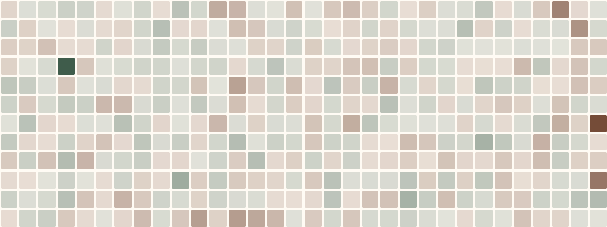
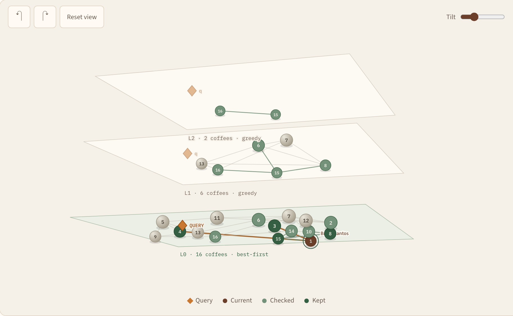
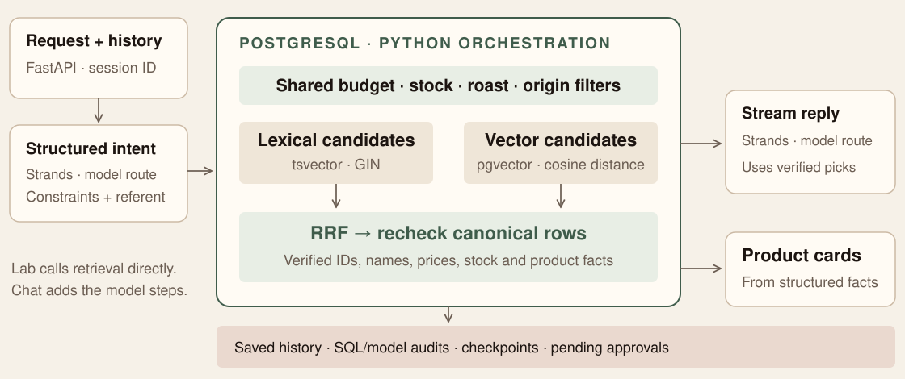

<!-- _class: title -->
<!-- _paginate: false -->

<p class="product">Coffee & queries</p>

# Hybrid Search in PostgreSQL

## Combining Vector and Full-Text for Real-World Applications

<div class="byline">
Shayon Sanyal · Principal PostgreSQL Specialist SA · Lead, Agentic AI for Databases
</div>

<div class="meta">
Postgres Summit US 2026 · New York City<br>
September 30 · 10:30–11:20 EDT · Letterpress
</div>

<!--
The official session is a practitioner talk about hybrid search. Start with
retrieval; the agent is an application of the same data contract. The full
50-minute run of show and fallbacks are in TALKING_POINTS.md.
-->

---

<!-- _class: takeaway -->

## Start with the customer's request

# “Something with bergamot.<br>Keep it under $20.”

Words capture explicit intent. Vectors capture related meaning.
**Neither gets to change the budget.**

<!--
Bergamot is a word we can look for. Related citrus and floral notes may also
help. The price is a constraint. These are three separate jobs; a similarity
score should not silently replace any of them.
-->

---

<!-- _class: bio -->
<!-- _paginate: false -->

<div class="bio-grid">
<div class="bio-photo">


</div>
<div class="bio-text">

## About me

# Shayon Sanyal

**Principal PostgreSQL Specialist Solutions Architect**
Tech Lead — Agentic AI for Databases

I help teams build on PostgreSQL, from relational applications to retrieval and agent workflows.

Today: readable SQL, visible ranking decisions, and a working coffee shop.

<div class="bio-links">linkedin.com/in/shayonsanyal</div>

</div>
</div>

<!-- Keep the introduction to 20 seconds. -->

---

## Two questions. Two comparisons.

<div class="journey-grid">
<div><span class="eyebrow">Why retrieve?</span><h3>Model only → grounded</h3><p>Can the answer establish what this shop actually sells, at this price, in stock?</p></div>
<div><span class="eyebrow">Why hybrid?</span><h3>Keyword · vector · hybrid</h3><p>Which candidates survive when requests contain exact terms, related concepts, and constraints?</p></div>
</div>

**Fluency is not evidence of current facts.** A model can also correctly ask for missing data.

Today: compare retrieval in **Lab**, inspect **Catalog**, measure in **Experiments**, converse in **Concierge**.

<!--
Model-only versus grounded is the motivating comparison, not an implemented
toggle in this version. A fair future toggle must hold model, prompt, and
settings constant and disclose which context each side gets. It should not
fabricate a bad answer: uncertainty is a valid model-only outcome.
It establishes the value of grounding, not the superiority of hybrid over
vector retrieval. The three Lab rankings make that second comparison.
The core demo is seven minutes; the Catalog walkthrough gets two more later.
-->

---

<!-- _class: regulars -->

## Meet the regulars

# Three people. Three retrieval questions.

<div class="regulars-grid">
<figure><figcaption><strong>Leo</strong><span>Curious, precise, budget-conscious</span><em>Bergamot · at most $20</em></figcaption></figure>
<figure><figcaption><strong>Maya</strong><span>Decisive, comfort-seeking</span><em>“Dessert” · a concept, not a label</em></figcaption></figure>
<figure><figcaption><strong>Yuki</strong><span>Origin-focused, particular</span><em>Coffee from Japan · a hard constraint</em></figcaption></figure>
</div>

<p class="portrait-note">Fictional personas · generated portraits · click a persona to read the brief</p>

<!--
These are the Lab names. Concierge reads customer names and preferences from
PostgreSQL; fresh seeds call the first two Marco and Ana. Introduce the person
with the brief, then use Compare this request. Opening or closing a brief does
not submit anything or discard the current draft.
-->

---

## One row, two search representations

| Catalog facts | Search representation | Purpose |
| --- | --- | --- |
| Name, origin, tasting notes, description | `search_document tsvector` | Explicit terms, phrases, Boolean logic |
| The same content, plus roast | `embedding vector(384)` | Related meaning with cosine distance |
| Price, stock, roast, origin | Relational columns | Eligibility before ranking candidates |

**Indexes:** GIN on the text document · HNSW with `vector_cosine_ops`.

The demo uses **BAAI/bge-small-en-v1.5**, locally through FastEmbed.

<!--
See schema.sql and seed.py. The model determines 384 dimensions here; this is
not a universal recommendation. Choose a model using representative queries,
languages, and resource limits. Changing models requires compatible query and
catalog embeddings, even when the dimension count happens to be the same.
-->

---

<!-- _class: code-first -->

## Give important text more weight

```sql
setweight(to_tsvector('english', name), 'A') ||
setweight(to_tsvector('english', origin), 'A') ||
setweight(to_tsvector('english',
  coffee_flavor_text(flavor_notes)), 'A') ||
setweight(to_tsvector('english', description), 'B')
```

Stored as a **generated `tsvector` column**. Schema code handles nulls.

Name, origin, and tasting notes carry **A** weight; description carries **B**.
The Catalog shows the actual document and its lexemes.

<!--
Excerpt from the expression in schema.sql. English full-text search operates
on normalized lexemes, not literal byte equality. Weighting influences lexical
rank; it does not override a price or stock filter. The generated text column
updates with its inputs. Embeddings need an explicit refresh when their source
content changes.
-->

---

<!-- _class: code-first -->

## Retrieve lexical candidates

```sql
SELECT id,
       ts_rank_cd(search_document,
         websearch_to_tsquery('english', $1), 32) AS score
FROM beans
WHERE search_document @@ websearch_to_tsquery('english', $1)
  AND in_stock > 0 AND price_cents <= $2
ORDER BY score DESC, id
LIMIT $3;
```

`$1` request · `$2` budget in cents · `$3` candidate depth

**“Bergamot”** can match a catalog term. **“Dessert”** may not.

<!--
Teaching excerpt of search.py. The app also applies roast and origin filters
and can optionally add trigram name matches. websearch_to_tsquery interprets
quoted phrases, OR, and exclusions. Normalization 32 bounds the lexical score;
it does not make that score comparable to cosine similarity.
-->

---

<!-- _class: code-first -->

## Retrieve semantic candidates

```sql
SELECT id, embedding <=> $1::vector AS distance
FROM beans
WHERE embedding IS NOT NULL
  AND in_stock > 0 AND price_cents <= $2
ORDER BY embedding <=> $1::vector
LIMIT $3;
```

`$1` request embedding · same budget · same candidate depth

Keep the **distance operator ascending in `ORDER BY`** for an HNSW path.
The planner may choose a sequential scan for a small catalog.

<!--
Cosine similarity is 1 minus cosine distance. Compute it for display after
retrieval; sorting an arbitrary similarity expression does not preserve the
indexable query form. Similarity is a ranking signal, not the probability that
a coffee answers the request. Inspect the actual plan rather than naming an
index because it exists.
-->

---

<!-- _class: takeaway -->

## Eligibility comes first

# Rank the coffees the customer can actually choose.

Apply the same budget, stock, roast, and origin predicates inside **both candidate branches**, before their limits.

<!--
This is a logical SQL boundary, not a claim that every predicate is pushed
inside an approximate index traversal. We will separate those on slide 18.
Filtering only after top-N retrieval can leave too few eligible rows and miss
better eligible candidates. Yuki's empty eligible set is a valid outcome.
The app's origin filter uses case-insensitive substring matching; production
country constraints would usually use canonical codes.
-->

---

## Fuse ranks, not incompatible raw scores

<p class="formula">RRF(d) = Σ 1 / (k + rank<sub>method</sub>(d))</p>

| Illustrative candidate | Keyword rank | Vector rank | RRF with k = 60 |
| --- | ---: | ---: | ---: |
| Coffee A | 1 | 3 | 1/61 + 1/63 = **0.03227** |
| Coffee B | — | 1 | 0 + 1/61 = **0.01639** |
| Coffee C | 2 | 2 | 1/62 + 1/62 = **0.03226** |

A missing branch contributes **zero**. The demo gives both branches equal weight.

<!--
These are arithmetic examples, not current catalog ranks. RRF can reward
agreement without pretending lexical and cosine scores share a scale. Rank one
starts at 1. RRF also discards the magnitude of score gaps; it is a useful
baseline to evaluate, not a guarantee of better relevance for every query.
-->

---

<!-- _class: code-first -->

## RRF is a full outer join

```sql
-- Each branch assigns row_number() after its candidate limit.
SELECT coalesce(s.id, l.id) AS id,
       coalesce(1.0 / ($1 + s.semantic_rank), 0) +
       coalesce(1.0 / ($1 + l.lexical_rank), 0) AS rrf_score
FROM semantic s
FULL OUTER JOIN lexical l USING (id)
ORDER BY rrf_score DESC, s.semantic_score DESC NULLS LAST,
         coalesce(s.id, l.id);
```

`$1` is **RRF k**. The app's complete CTE query is in `search.py` and **Lab → SQL**.

One statement combines both rankings and canonical product rows.

<!--
The preceding lexical and semantic CTEs assign row_number with stable ID
ordering for ties. The final app query joins beans for current facts. The
comparison and diagnostics share a repeatable-read snapshot. EXPLAIN ANALYZE
is a separate execution in that transaction. Two CTEs do not promise concurrent
execution; parallel workers and scan choices must appear in the plan.
-->

---

## Three knobs that change different things

| Knob | What it controls | What to watch |
| --- | --- | --- |
| **Candidate depth** | How many rows each retrieval branch can contribute | A missing candidate cannot be recovered by fusion |
| **RRF k** | How sharply contributions fall with rank | Smaller k emphasizes the top ranks more |
| **Minimum cosine** | An optional semantic acceptance threshold | Can remove useful semantic candidates; lexical ones can remain |

Change **one knob at a time** and inspect the same requests.

HNSW's **`ef_search`** is a separate index-search setting.

<!--
Defaults in search.py are 12 candidates per branch and RRF k=60. Do not call k
the result count or confuse candidate depth with HNSW ef_search. A minimum
cosine threshold applies to the semantic branch after its candidate selection;
it does not make the union require every result to pass that threshold.
-->

---

<!-- _class: demo-slide -->

## Live demo · seven minutes

# Meet → compare → inspect → converse

| Stop | Action | Evidence |
| --- | --- | --- |
| **Leo** | Open brief → **Compare this request** | Bergamot matches within the $20 maximum |
| **Maya** | Compare “dessert” | Meaning beyond the catalog's exact vocabulary |
| **One coffee** | **Why this coffee** → **SQL** | Branch ranks and RRF contributions |
| **Yuki** | Compare “Coffee from Japan” | Origin eligibility; empty when nothing qualifies |
| **Concierge** | Espresso regular → “Cold brew options” → **Order that** | Same recommended bean; pending approval |

<p class="stage-url">localhost:8017 · full script: docs/DEMO.md</p>

<!--
Start in Lab, not Concierge. Persona shortcuts 1/2/3 open the same briefs.
In Concierge, Use this request fills the composer; Send starts the response.
Wait for a completed product recommendation before Order that. Keep the same
session and inspect the actual bean ID; do not promise a particular coffee.
The application queues one bag and does not fulfill it. If the model fails,
finish with Lab and SQL; the later static architecture slides cover the design.
-->

---

<!-- _class: split-evidence -->

## From a coffee's text to its vector

<div class="evidence-grid">
<div>

### Inspect the representation

1. Open **Catalog** and select a coffee.
2. Compare the source text and weighted lexemes.
3. Inspect the stored **384 dimensions**.
4. Continue below to **How HNSW finds a coffee**.

</div>
<div class="evidence-image">



</div>
</div>

<p class="caption">Actual stored values · dimensions do not have human-assigned flavor labels</p>

<!--
The heatmap is an inspection aid. A single component is not a named concept
such as sweetness. Distances compare the full vector. The next visualization
projects the data for display, while retaining full-dimensional comparisons.
-->

---

<!-- _class: diagram-slide -->

## HNSW: navigate broadly, then search locally


<p class="caption">Conceptual hierarchy · the same point may appear at several levels</p>

<!--
HNSW means Hierarchical Navigable Small World. Begin at a sparse upper layer,
move toward closer neighbors, and descend using the current entry point. At
layer zero, a bounded candidate search explores alternatives. Approximation
trades search work for neighbor recovery. This schematic explains the idea;
it is not an exported graph from the PostgreSQL index.
-->

---

<!-- _class: split-evidence -->

## Follow this query through the graph

<div class="evidence-grid walkthrough-grid">
<div class="evidence-image">



</div>
<div>

### Catalog · two-minute walkthrough

**Trace query** → **Next step** → descend → inspect candidates → compare with exhaustive neighbors.

Rotate the view. Click a coffee. Change **ef** and replay.

**Real catalog vectors and query distances. Illustrative layers and links.**

</div>
</div>

<p class="caption">Projected layout · no eligibility filters · no database settings changed</p>

<!--
Use bergamot, default ef=4, and the step slider. Pause on an upper-layer
comparison, then on base-layer candidate expansion. Jump to the final step;
change ef to 16 and compare again. Describe the observed recovery.

The app reads up to 48 public catalog embeddings. It constructs deterministic
teaching layers and nearest-neighbor links, then runs greedy upper descent and
bounded best-first base search. Distances use all 384 dimensions. The 3D layout
uses two PCA components, visual offsets, and stacked planes. Neither the links
nor visited nodes are pgvector's stored graph or a recorded index scan.
-->

---

<!-- _class: code-first -->

## A SQL filter is not an ANN pre-filter

An HNSW scan can visit neighbors that the executor later rejects.
A selective filter may leave fewer results than the requested limit.

```sql
BEGIN;
SET LOCAL hnsw.ef_search = 100;
SET LOCAL hnsw.iterative_scan = strict_order; -- pgvector 0.8+
-- Run the filtered nearest-neighbor query here.
COMMIT;
```

Consider an exact scan over a selective relational subset, partial indexes,
or partitioning when they fit the workload. **Measure the plan and recall.**

<!--
Source: pgvector 0.8.2 README, Filtering and Iterative Index Scans. Iterative
scans search further when needed, subject to scan and memory limits; they do
not guarantee exact neighbor recovery. The live illustration's ef control
changes only the teaching search. It does not run these SET commands.
-->

---

## Read the plan that actually ran

**Lab → SQL → EXPLAIN** executes `EXPLAIN (ANALYZE, BUFFERS)`.

- Scan type and index name: did PostgreSQL choose HNSW, GIN, or a table scan?
- Actual rows and filters: where were candidates removed?
- Sorts, buffers, and execution time: where did the work go?
- Parallel workers: two retrieval branches alone do not establish parallelism.

**A 16-coffee catalog is good for explanation. It is not a scale benchmark.**

<!--
The status endpoint reports actual catalog counts, versions, and indexes.
Small tables may correctly favor a sequential scan. The Lab exposes embedding,
query, and diagnostic timings separately; its EXPLAIN runs the SQL again.
Do not conflate these measurements with end-to-end model latency or use one
warm execution as a production p95/p99 claim.
-->

---

## Measure the index separately

**Experiments → exact versus HNSW** uses **12,000 synthetic 384-d vectors**
in a separate schema, with a real HNSW index.

| Change | Compare |
| --- | --- |
| `ef_search` | Neighbor recovery against the exact top 20 |
| Selective filter; iterative scan mode | Returned count, recall, actual scan plan |
| Repeated runs | Query timing and cache/order effects |

**Recall@20 measures neighbor recovery. It does not measure coffee relevance.**

<!--
Optional prepared demonstration; stage controls default off. Prepare fixture
creates rows in search_lab_experiment, not the coffee catalog. Exact and ANN
runs deliberately use different planner settings and run exact first; the
page reports these limitations. Verify hnsw_used and the index name. Avoid
inventing recall/latency curves or calling these synthetic embeddings a
representative production corpus. m and ef_construction are build settings;
ef_search is a query setting. See appendix operations for the distinctions.
-->

---

<!-- _class: code-first -->

## Need an exact term? Make it a constraint.

```sql
SELECT id, name, embedding <=> $1::vector AS distance
FROM beans
WHERE search_document @@ websearch_to_tsquery('english', $2)
  AND embedding IS NOT NULL
  AND in_stock > 0 AND price_cents <= $3
ORDER BY embedding <=> $1::vector
LIMIT $4;
```

“Related to this question” **AND** “contains the required lexemes.”

This changes the candidate set. RRF's union answers a different requirement.

<!--
Runnable parameterized pattern in SQL_PATTERNS.md. This is an extension pattern,
not a hidden Lab mode. Here $1 is the question embedding, $2 the required text,
$3 the budget, and $4 the result count. If minimum similarity is required too,
add and evaluate an explicit distance threshold. GIN filtering followed by an
exact distance sort may be attractive for a small text-matched subset; confirm
with EXPLAIN. SQL syntax alone does not guarantee that physical plan.
-->

---

## Evaluate the result, then add complexity

**Relevance:** judge representative requests, including paraphrases and misses.
Use **Experiments → blind judging** to compare without method labels.

**Eligibility:** independently check budget, origin, roast, and stock.
A plausible answer can still violate a requirement.

**Extensions:** rerank eligible candidates with preference or popularity signals;
expand an allowed category through a recursive CTE before retrieval.

**Keep a baseline.** Track whether each addition improves the requests that matter.

<!--
Blind judgments are local demo feedback, not a statistically representative
benchmark. Separate retrieval metrics from business constraint checks. Metadata
boosting and recursive category expansion are design extensions, not implemented
Lab controls. The appendix has a relationship-aware SQL example. Avoid mixing
uncalibrated raw scores; start with explicit, bounded tie-breaks or separately
ranked signals, then evaluate the result and eligibility invariants.
-->

---

<!-- _class: diagram-slide -->

## Add a conversation around the same retrieval



<p class="caption">Model route is selectable · product cards come from canonical catalog rows</p>

<!--
The implementation uses Strands for model calls and Python for database
orchestration. Do not call it framework-free or hard-code a model pairing from
an older rehearsal. Read the selected route in Concierge. Intent and response
are separate roles. Model access needs a successful invocation in the intended
account and region; a connected database is not model-access proof.
-->

---

## “Order that” should refer to the same coffee

1. Complete a recommendation and retain its bean ID in the conversation.
2. Resolve the follow-up against that **same customer and session**.
3. Recheck the selected bean against current facts and constraints.
4. Queue **one pending approval** for that bean and one bag.

The acknowledgment, product card, and approval must agree.

**This demo queues a request. It does not charge, fulfill, or decrement stock.**

<!--
Use the espresso regular and inspect the actual returned ID. The intent model
can resolve a structured order_referent_bean_id; the coordinator checks recent
recommendations and canonical data. Order that is unavailable until a completed
reply contains a product. A new session loses that local conversation referent.
Approving a row manually would not run a fulfillment worker: none is provided.
-->

---

## Be precise about what the app proves

| Inspectable now | Still requires implementation or evaluation |
| --- | --- |
| Canonical product cards and eligibility checks | Correctness of every generated sentence |
| Saved messages and workflow checkpoints | Automatic replay after a crash |
| SQL and successful model-call audit records | Atomic commit of the entire multi-step turn |
| Pending approvals | Authorized fulfillment and payment |
| Local demo with session ownership checks | Authentication, tenant isolation, production load testing |

The **data-coverage score is a heuristic**, not a probability of correctness.

<!--
An entire turn spans separate reads, writes, and model calls. Do not claim the
audit, checkpoints, approvals, and external effects share one transaction.
The SQL comparison has a consistent snapshot; that narrower guarantee does not
extend across the whole conversation. Generated prose can still be wrong or
influenced by prompt injection. Keep the local application bound to loopback.
-->

---

<!-- _class: takeaway -->

## Three things to take home

# Retrieve for meaning.<br>Filter for eligibility.<br>Measure before you tune.

Hybrid search is a composable SQL pattern.
**The query plan and the returned rows are the evidence.**

<!--
Return to the opening request. Bergamot asks for words and meaning. Twenty
dollars asks for a filter. RRF combines candidate ranks. Index tuning and model
choice cannot fix a retrieval contract that ignores one of those requirements.
-->

---

<!-- _class: code-first -->

## Run it yourself

```bash
# From conferences/2026-postgresconf-agentic-ai in the repo:
python3 -m venv .venv
source .venv/bin/activate
python -m pip install -r requirements.txt
# Configure a dedicated demo database as described in README.
python scripts/initialize_demo.py
./run-demo.sh
```

**localhost:8017** · Python 3.11+ · PostgreSQL 18 with `vector` and `pg_trgm`

Lab and Catalog use local embeddings. Concierge also needs model access.

[github.com/shayons/talks](https://github.com/shayons/talks)

<!--
README contains the complete PostgreSQL 18 database and environment setup, model route
configuration, and migrations for older databases. The initializer preserves
an existing populated catalog. Do not tell an audience to apply schema.sql to
a database they want to keep: it drops and recreates tables. First embedding
use downloads the model; rehearse before going offline.
-->

---

<!-- _class: thanks -->
<!-- _paginate: false -->

# Thank you.

What does **your** query need to preserve?

Shayon Sanyal · Coffee & queries

[github.com/shayons/talks](https://github.com/shayons/talks)

<!--
Reserve six minutes for questions. Appendix slides are optional: relationship
expansion, operating considerations, and references. If helpful, answer against
the running Lab or HNSW walkthrough without changing database state.
-->

---

<!-- _class: code-first dense -->

## Appendix · expand a relationship before retrieval

```sql
WITH RECURSIVE regions(name, parent) AS (
  VALUES ('Asia-Pacific', NULL::text),
         ('Indonesia', 'Asia-Pacific'), ('Sumatra', 'Indonesia')
), allowed(name) AS (
  SELECT name FROM regions WHERE name = $1
  UNION
  SELECT r.name FROM regions r JOIN allowed a ON r.parent = a.name
)
SELECT b.id, b.name
FROM beans b
WHERE b.in_stock > 0 AND b.embedding IS NOT NULL
  AND EXISTS (SELECT 1 FROM allowed a
              WHERE strpos(lower(b.origin), lower(a.name)) > 0)
ORDER BY b.embedding <=> $2::vector LIMIT $3;
```

Illustrative taxonomy. Production: canonical relationships and explicit access rules.

<!--
This is a standalone extension sketch, not an application feature. $1 is the
root category, $2 the request vector, $3 the result count. UNION deduplicates
names and terminates this name-only traversal even with cycles. Origin matching
uses the demo's substring convention; use a proper foreign-key mapping when
categories must be exact. Complete parameters and execution are in
SQL_PATTERNS.md. Add the same price and roast predicates when required.
-->

---

## Appendix · operate the measured workload

| Area | Inspect before changing it |
| --- | --- |
| **HNSW build** | `m`, `ef_construction`, index size, build memory and insert cost |
| **HNSW search** | `ef_search`, filtered recall, iterative scan limits |
| **Text retrieval** | Document weights, language configuration, GIN and update cost |
| **Connections** | Concurrent database work, pool waits, transaction duration |
| **Retention** | Message/audit growth, ANALYZE, vacuum and retention policy |

Separate embedding, SQL, and model-call timings. Benchmark representative data,
filters, concurrency, and warm/cold conditions before setting service targets.

<!--
No universal ef_search-to-recall table, row-count cutoff, or pool size is
established by this demo. Sequential queries per turn do not imply that all are
concurrently in flight. Do not hold a database transaction open across a long
model response. Plan model migration and embedding refresh alongside ordinary
PostgreSQL maintenance. Current pgvector docs describe each index setting.
-->

---

<!-- _class: references -->

## References and reproducible paths

- **PostgreSQL 18:** [Full-text search](https://www.postgresql.org/docs/18/textsearch.html), [WITH and recursive queries](https://www.postgresql.org/docs/18/queries-with.html), [Using EXPLAIN](https://www.postgresql.org/docs/18/using-explain.html)
- **pgvector 0.8.2:** [HNSW, filtering, iterative scans, and recall](https://github.com/pgvector/pgvector/tree/v0.8.2)
- **RRF:** Cormack, Clarke & Büttcher, [SIGIR 2009](https://doi.org/10.1145/1571941.1572114)
- **HNSW:** Malkov & Yashunin, [Hierarchical navigable small world graphs](https://arxiv.org/abs/1603.09320)
- **This repository:** `schema.sql`, `search.py`, `static/hnsw-core.mjs`, `experiments.py`
- **Presenter material:** `docs/DEMO.md`, `deck/TALKING_POINTS.md`, `deck/SQL_PATTERNS.md`

<p class="caption">Deck aligned with the local application · September 10, 2026</p>

<!--
Conference title, date, time, and room checked against the official session
listing on September 10, 2026. Technical sources are versioned where practical.
The graph is a teaching implementation, not pgvector instrumentation. Refer to
local source and observed query plans for claims about this demo's behavior.
-->
